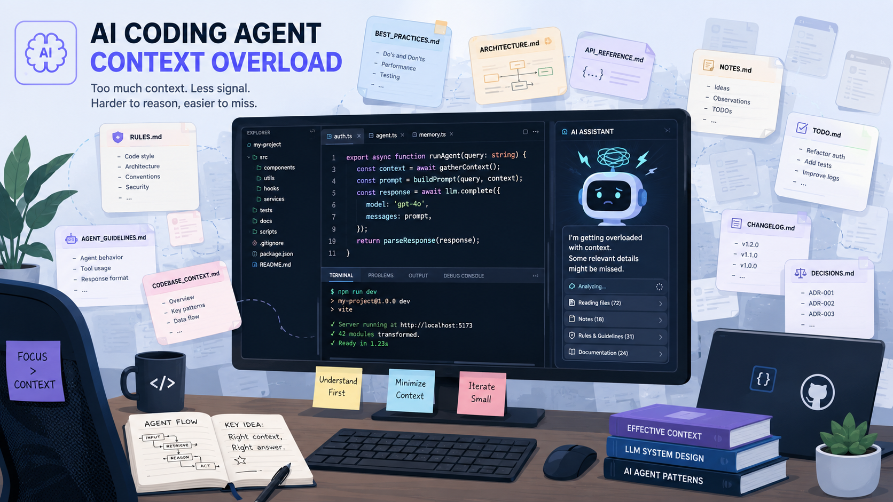
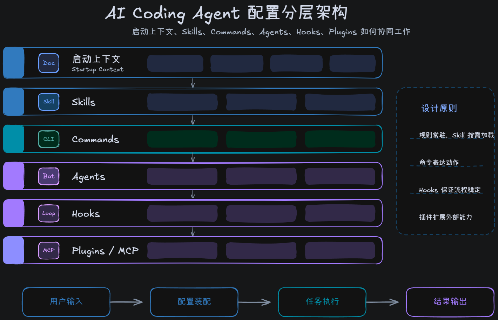
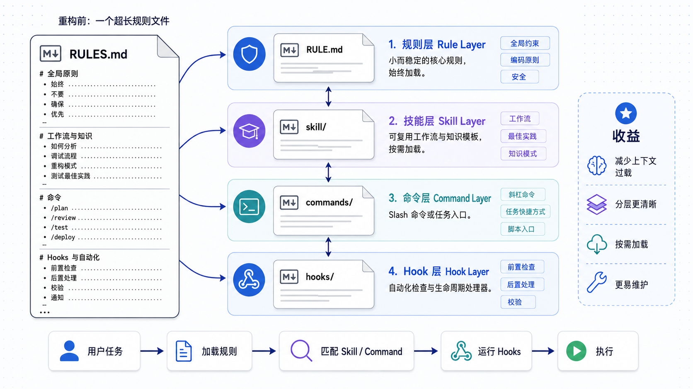

+++
title = '从 Everything Claude Code 看 AI Coding Agent 的规则管理体系'
date = 2026-07-31T00:00:00+08:00
draft = false
description = '从 Everything Claude Code 的配置组织方式出发，梳理 Rule、Skill、Command、Agent、Hook、Plugin 在 AI Coding Agent 规则管理体系中的职责边界。'
categories = ['ai-coding']
tags = ['Claude Code', 'Codex', 'AI Agent', 'Rules', 'Skills']
+++

## 背景

这两年 Coding Agent 的变化很快。先是 Claude Code、Codex 这类工具进入日常开发流程，后来 Skills 开始流行，再到现在大家讨论 Harness、Hooks、Subagents、Plugins。表面上看，这些都是不同工具的新能力；放到一起看，其实都在解决同一个问题：怎样让 Agent 在足够自由的同时，仍然按我们预期的方式做事。

我一开始也把问题理解得比较简单：Rule 写好一点，Skill 写详细一点，Agent 就会稳定一点。于是我根据自己的工作流做了几个 Skill，也会从网上复制各种语言的 Rule 文档放进项目里。刚开始效果不错，但用得越久，问题越明显。



Rule 文件会慢慢变成一个杂物间。里面既有绝对不能违反的约束，也有语言最佳实践、代码正反例、工作流步骤、工具使用说明，甚至还有某次踩坑后的经验总结。每一条单独看都有道理，合在一起就很乱。

更麻烦的是，Rule 通常会直接进入 Agent 的启动上下文。它不像 Skill 那样按需加载，只要文件存在，Agent 每次做任务都要加载这些内容。Rule 越长，默认上下文越重，真正重要的红线反而容易被淹没。

所以我现在更倾向于把问题拆开看：AI Coding Agent 的规则管理，不是简单的全部一股脑塞进 Rule 中（就像写项目时没有提前规划架构，导致产生所谓“Spaghetti”式代码），而是一套按加载时机和职责边界分层的配置体系。

## Everything Claude Code 给我的启发

[everything-claude-code](https://github.com/affaan-m/ECC) 这个项目起初我只是作为一个 Rule 参考项目，但后来发现它的架构设计思路也很好，其将 Claude Code 周边的配置能力拆成了不同层：

- `CLAUDE.md` 负责默认记忆和项目上下文
- `rules/` 负责常驻原则
- `skills/` 负责按需加载的任务能力
- `commands/` 负责固定任务入口
- `agents/` 负责专门角色
- `hooks/` 和 `settings` 负责确定性自动化和权限配置

这比单纯堆一个超长 Rule 文件更合理。因为不同内容的生命周期不一样，加载时机也不一样。

有些内容 Agent 每次都必须知道，比如不要覆盖用户未请求修改的文件、测试失败不能声称完成、不要泄露密钥。这类内容适合常驻。另一些内容只在特定任务里有用，比如 Spring Boot 分层怎么 review、Rust 错误处理有哪些惯例、ADR 应该怎么写。这些内容放进启动上下文就是浪费，放进 Skill 才更合适。

如果再往外看，Command、Agent、Hook、Plugin 也不是装饰品。它们分别解决入口、角色、自动化和分发问题。把这些层级区分开，规则系统才不会越写越重。

## 核心模型：按加载时机和职责分层

我现在会把 AI Coding Agent 的配置分成六层：



| 层级       | 典型载体                        | 加载方式     | 适合放什么                                  | 不适合放什么       |
| ---------- | ------------------------------- | ------------ | ------------------------------------------- | ------------------ |
| 启动上下文 | `CLAUDE.md`、`AGENTS.md`、Rules | 默认读取     | 红线、项目不变量、极短约束                  | 大量示例、长篇教程 |
| 按需能力   | `skills/*/SKILL.md`             | 触发后读取   | 工作流、示例、检查清单、模板                | 全局底线           |
| 固定入口   | `commands/*.md`                 | 用户显式调用 | 高频任务入口、参数化提示                    | 完整知识库         |
| 角色隔离   | `agents/*.md`                   | 委派时加载   | reviewer、architect、debugger 等专门角色    | 通用项目规则全集   |
| 确定性护栏 | Hooks、scripts                  | 事件触发     | 格式化、检查、阻断危险操作                  | 需要语义判断的建议 |
| 分发层     | Plugin、配置仓库                | 安装时生效   | 一组 rules、skills、agents、commands、hooks | 单篇长规则         |

如果一条规则每次任务都必须生效，而且违反后代价很高，它可以进入启动上下文。如果一段说明只有做某类任务时才有用，它应该进入 Skill。如果一个约束可以被脚本稳定检查，就不要只靠自然语言提醒 Agent。能自动化的交给 Hook，不能自动化的再交给 Rule 或 Skill。

## Rule：常驻，所以必须短

Rule 的价值在于常驻。正因为它常驻，所以它必须短。

适合进入 Rule 的内容通常有三个特点：

- 跨任务稳定成立
- 违反后代价很高
- Agent 默认就必须知道

比如：

```md
- 不要覆盖用户未请求修改的文件。
- 修改数据库 schema 必须配套 migration。
- 测试失败时不能声称任务完成。
- 不要绕过认证、授权和输入校验。
```

这些规则不依赖具体语言，也不需要展开成长篇教程。Agent 每次工作都应该知道它们。

不适合放进 Rule 的内容也很典型：

- Spring Boot Controller 应该怎么分层
- Rust 错误处理有哪些正反例
- React 性能优化检查清单
- 某次项目复盘总结出的完整经验
- 一整套 code review 工作流

这些内容不是不重要，而是不应该常驻。它们需要在对应任务里出现，而不是每次都挤占上下文。

一句话理解 Rule：通用、稳定、短、硬。

## Skill：按需加载的任务能力包

Skill 不是 Rule 的加长版。更准确地说，Skill 是按需加载的任务能力包。

一个 Skill 可以包含完整步骤、判断标准、代码示例、正反例、脚本和模板。它可以比 Rule 详细得多，因为它只有在相关任务中才进入上下文。

比如一个 `spring-boot-review` Skill 可以这样组织：

```text
skills/
└── spring-boot-review/
    ├── SKILL.md
    ├── references/
    │   ├── controller-patterns.md
    │   └── transaction-boundaries.md
    └── scripts/
        └── check-layering.ps1
```

`SKILL.md` 负责告诉 Agent 什么时候使用这个 Skill，以及 review 的基本流程。更长的模式说明放到 `references/`，能稳定运行的检查放到 `scripts/`。这样 Agent 一开始只需要看到 Skill 的名称和描述，真正触发时再逐层读取。

好的 Skill 至少要回答四个问题：

- 什么时候该触发？
- 执行步骤是什么？
- 怎么判断结果是对的？
- 有没有可以复用的脚本、模板或参考资料？

如果一个 Skill 只有一段泛泛而谈的原则，它可能应该回到 Rule。如果一个 Rule 已经长到需要示例、反例和步骤，它大概率应该拆成 Skill。

## Command、Agent、Hook 的边界

除了 Rule 和 Skill，AI Coding Agent 的配置里还有几类很容易混在一起的东西。

Command 负责固定入口。比如 `/review`、`/test`、`/explain`，它们适合启动一个高频任务。Command 不应该变成知识库，它最好只是告诉 Agent 这次要做什么、参数是什么、要调用哪些 Skill 或遵守哪些输出格式。

Agent 负责角色隔离。比如 reviewer、architect、security-auditor、debugger。它解决的是 "谁来做" 的问题，而不是 "规则写在哪里" 的问题。需要独立上下文、专门判断标准，或者并行处理时，Agent 比把所有说明塞进 Rule 更合适。

Hook 负责确定性自动化。如果一条约束可以被机器稳定检查，就不该只写成自然语言提醒。比如格式化、敏感文件检查、禁止危险命令、提交前运行最小测试，这些都更适合 Hook 或脚本。

可以用这个表快速判断：

| 需求                 | 放在哪里                       |
| -------------------- | ------------------------------ |
| 每次任务都必须知道   | Rule、`CLAUDE.md`、`AGENTS.md` |
| 只有做某类任务才需要 | Skill                          |
| 想用一个命令启动     | Command                        |
| 需要专门角色判断     | Agent                          |
| 机器能稳定检查       | Hook、script                   |
| 想跨项目分发整套能力 | Plugin、配置仓库               |

这个判断表比抽象定义更实用。很多规则系统变乱，就是因为一开始没有给这些内容划边界。

## 一个拆分例子

假设原来有一条很长的 Rule：



```md
写 Spring Boot API 时，Controller 不要包含业务逻辑，Service 负责事务，Repository 只负责数据访问。Controller 要校验参数，错误返回统一格式。下面是 10 个正反例……
```

这条规则的问题不是内容错，而是承载位置错。它同时包含原则、实战细节和示例，放进常驻 Rule 会越来越长。

更合适的拆法是：

```text
rules/architecture.md
- Controller 不承载业务逻辑，事务边界放在应用服务层。

skills/spring-boot/SKILL.md
- 说明 Controller / Service / Repository 的具体写法
- 给出正反例
- 给出 review checklist

commands/spring-review.md
- 启动 Spring Boot review 流程
```

这样常驻上下文只保留最短原则，具体怎么做交给 Skill，高频入口交给 Command。

再看一个 Hook 的例子：

```md
提交前必须格式化代码。
```

这句话可以留在 Rule 里，但只靠 Rule 不够。格式化是机器能稳定检查的事，更好的做法是：

```text
Rule: 非生成文件不要提交未格式化代码。
Hook/script: 自动运行 formatter，失败则阻断。
```

自然语言适合表达判断，脚本适合处理确定性检查。两者不要互相替代。

## 推荐目录结构

如果是个人 AI coding 配置仓库，可以先用一个简单结构：

```text
ai-config/
├── rules/
│   ├── principles.md
│   ├── simplicity.md
│   ├── error-handling.md
│   ├── security.md
│   └── testing.md
├── skills/
│   ├── rust-development/
│   │   └── SKILL.md
│   ├── spring-boot/
│   │   └── SKILL.md
│   ├── api-design/
│   │   └── SKILL.md
│   └── database-design/
│       └── SKILL.md
├── agents/
│   ├── reviewer.md
│   └── architect.md
├── commands/
│   ├── review.md
│   └── explain.md
└── scripts/
    ├── install.ps1
    └── check.ps1
```

这里不要一开始就设计得太复杂。先保证每层职责清楚：

- `rules/` 写短规则和红线
- `skills/` 写任务流程和实战细节
- `agents/` 写专门角色
- `commands/` 写高频入口
- `scripts/` 写可重复检查和安装逻辑

等到这些内容需要跨项目安装、版本化、权限配置和工具连接时，再考虑把它们打包成 Plugin。没有稳定复用前，不需要为了看起来完整而提前做分发层。

## 我的取舍原则

整理 Rule 和 Skill 时，我会按下面几个问题判断：

- 这条内容是不是每次任务都必须知道？如果不是，先不要放进 Rule。
- 它是不是只有某类任务才用得到？如果是，放进 Skill。
- 它是不是一个固定入口？如果是，放进 Command。
- 它是不是需要一个专门角色来判断？如果是，放进 Agent。
- 它能不能被脚本稳定检查？如果能，优先写成 Hook 或 script。
- 它是不是已经在多个项目里稳定复用？如果是，再考虑 Plugin 或安装脚本。
- 这个顺序能避免一个常见问题：把所有东西都写成 Rule。Rule 看起来最简单，长期维护成本反而最高。

同时也推荐将这些内容直接整理为一个 `rule-creator` 或 `skill-creator` Skill，让 AI 自己根据需求生成对应文档。

## 常见误区

**把 Rule 写成知识库**，会让默认上下文越来越重。Rule 应该像红线，不应该像教程。

**把 Skill 写成万能手册**，会让触发范围变得模糊。一个 Skill 最好对应一类明确任务。

**把 Command 写成教程**，入口会变得很重。Command 只负责启动流程，不负责承载所有知识。

**把 Agent 写成另一个总规则文件**，角色边界会模糊。Agent 应该有明确职责和输出标准。

**把 Hook 写成复杂业务判断**，脚本适合确定性检查，不适合替代语义判断。

**复制网上 Rule 不消化**，会把别人的项目约束带进自己的项目。Rule 不是越多越稳，只有和当前工作流匹配才有价值。

## 总结

Rule 和 Skill 写得好，确实能提高 Agent 的稳定性。但更关键的是，不同类型的约束要放在不同层。

Rule 是常驻底线，要短。Skill 是按需加载的实战手册，可以详细。Command 是入口，Agent 是角色，Hook 是自动化护栏，Plugin 是分发方式。

把这些边界分清楚以后，AI coding 配置才会越用越清楚，而不是越积越重。

## 参考资料

- [Anthropic: Manage Claude's memory](https://docs.anthropic.com/en/docs/claude-code/memory)
- [Anthropic: Skills](https://docs.anthropic.com/en/docs/claude-code/skills)
- [Anthropic: Slash commands](https://docs.anthropic.com/en/docs/claude-code/slash-commands)
- [Anthropic: Subagents](https://docs.anthropic.com/en/docs/claude-code/sub-agents)
- [Anthropic: Hooks](https://docs.anthropic.com/en/docs/claude-code/hooks)
- [Anthropic: Plugins](https://docs.anthropic.com/en/docs/claude-code/plugins)
- [GitHub: everything-claude-code](https://github.com/affaan-m/everything-claude-code)
