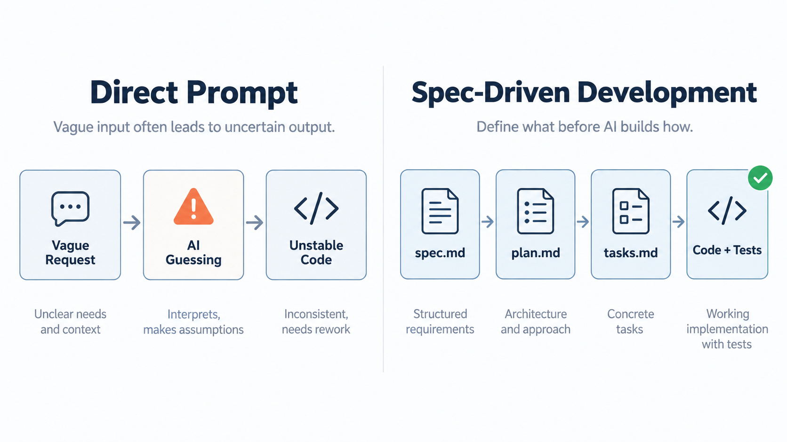
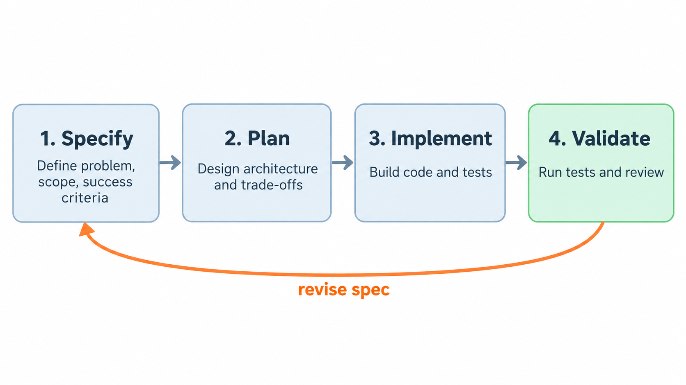

+++
title = '什么是 Spec-Driven Development：让 AI 先读懂需求，再开始写代码'
date = 2026-09-15T00:00:00+08:00
draft = false
description = '介绍 Spec-Driven Development 的核心思想、四阶段流程、三文件体系，以及如何写出能约束 AI 实现的好 Spec。'
categories = ['ai-coding']
tags = ['SDD', 'Spec-Driven Development', 'AI Coding', 'Spec Kit']
image = 'cover.png'
+++

AI Coding 让“写代码”变快了，但也放大了另一个问题：如果需求本身是模糊的，AI 只会更快地产生一堆看似合理、实际偏题的代码。

所以我最近在看 SDD，也就是 Spec-Driven Development。它的核心不是多写一份文档，而是把规格说明变成开发流程里的真实源头：先把“要做什么、为什么做、做到什么程度算完成”说清楚，再让 AI 去处理“怎么实现”。

一句话理解 SDD：

> 先由人定义 What，再让 AI 推导 How。

你可以从这篇文章了解四件事：

- SDD 到底是什么
- SDD 的标准四阶段流程
- `spec.md`、`plan.md`、`tasks.md` 三文件体系怎么流转
- 一个好的 Spec 应该怎么写

## 1. SDD 是什么

SDD，全称 Spec-Driven Development，可以翻译为规格驱动开发。

传统开发里，文档经常只是代码之前的脚手架：需求评审时写一写，开发时参考一下，项目推进后很容易和代码脱节。到了 AI Coding 场景，这个问题会更明显。因为 AI 不是项目成员，它不知道你的历史上下文、团队习惯和隐含边界。你给它一个模糊输入，它就会用自己的默认假设补全空白。

SDD 的思路是反过来：规格说明不是代码的附属品，而是唯一真实来源。代码、测试、任务拆分和实现计划，都从 Spec 派生出来。

也就是说，AI 写得好不好，不只取决于模型能力，也取决于 Spec 是否足够清楚。

可以粗略对比一下：

| 开发方式         | 核心输入                     | 常见问题                                |
| ---------------- | ---------------------------- | --------------------------------------- |
| 直接 Prompt 编程 | 一段自然语言需求             | AI 容易自由发挥，边界和验收标准不稳定   |
| 传统文档驱动     | PRD、设计文档、会议结论      | 文档和代码容易脱节                      |
| SDD              | 可验证的 Spec + Plan + Tasks | 前期要花时间迭代 Spec，但后续实现更可控 |

所以 SDD 不是“写更多文档”，而是把需求从“描述性文本”变成“可约束实现的开发输入”。



## 2. SDD 的四阶段流程

一个典型的 SDD 流程可以拆成四个阶段：

| 阶段      | 主导者  | 核心产出               | 关键动作                                   |
| --------- | ------- | ---------------------- | ------------------------------------------ |
| Specify   | 人      | `spec.md`              | 定义问题、目标、边界、成功标准             |
| Plan      | 人 + AI | `plan.md`              | 根据 Spec 生成架构方案、模块划分、接口设计 |
| Implement | AI      | 代码 + 测试            | 按任务逐步实现                             |
| Validate  | 人 + AI | 测试结果 + Review 结论 | 自动化测试、人工审查、回到 Spec 修正偏差   |

这四步里，最容易被低估的是第一步 Specify。

很多 AI 编程失败，不是失败在 Implement，而是失败在 Specify。需求里没有说清楚目标边界，AI 就会替你做决定；成功标准没有写成可验证条件，AI 就会用“功能已经完成”这种描述性结论糊过去；Non-Goals 没写清楚，AI 就可能顺手加一个你并不需要的功能。

SDD 想解决的正是这个问题：在代码生成之前，把关键约束提前落到文档里。这其实和如今（2026年）AI Coding 圈中提到的“关键决策前置”理念类似。




注意最后一条回路：如果验证阶段发现问题，不应该只在代码里打补丁，而是先判断 Spec 是否写错、写漏或写得太模糊。否则下一次让 AI 继续改，很可能又会沿着同一个模糊输入跑偏。

## 3. 三文件体系：Spec、Plan、Tasks

GitHub 的 Spec Kit 把 SDD 落成了一套比较清晰的文件流转方式：`spec.md`、`plan.md`、`tasks.md`。

这三个文件分别回答三个问题：

| 文件       | 回答的问题                       | 不该承担的职责       |
| ---------- | -------------------------------- | -------------------- |
| `spec.md`  | 做什么，为什么做，怎么验收       | 不写具体技术实现细节 |
| `plan.md`  | 如何实现，架构怎么选，模块怎么拆 | 不重新发明需求       |
| `tasks.md` | 按什么顺序交付，每一步怎么验证   | 不塞进大段设计讨论   |

### spec.md：定义 What 和 Why

`spec.md` 是 SDD 的起点。它应该回答：

- 为什么要做这个功能？
- 用户是谁？
- 用户在什么场景下使用？
- 功能边界在哪里？
- 做到什么程度算完成？
- 本期明确不做什么？
- 有哪些必须遵守的技术或业务约束？

这里最重要的一点是：`spec.md` 不应该提前写死具体实现。

比如：

```text
使用 Redis 分布式锁防止订单重复提交。
```

这句话已经进入 How 的范围了。除非“必须使用 Redis 分布式锁”本身就是项目约束，否则它不适合放在 Spec 里。

更适合作为 Spec 的说法是：

```text
订单创建接口必须支持幂等：客户端使用同一个 Idempotency-Key 重试请求时，系统最多创建一笔订单，并返回同一个订单编号。
```

这句话没有绑定具体技术栈，但它足够约束实现。无论最后用数据库唯一约束、Redis 锁还是其他方案，都必须满足“同一个幂等键最多创建一笔订单”这个可验证标准。

这里涉及到了如何编写一个“好的 Spec”，后面第四章会有具体说明。

### plan.md：把需求翻译成方案

`plan.md` 基于 `spec.md` 生成，负责回答“怎么做”。

这一步可以让 AI 先生成方案，但人必须 review。因为 AI 很容易给出看似完整、实际不适合当前项目的设计，比如：

- 引入一个项目里没有的基础设施
- 把简单功能拆成过多模块
- 忽略现有架构边界
- 给出无法测试或无法回滚的方案

好的 `plan.md` 应该能解释关键设计选择，而不是只列一个技术清单。

比如：

```text
选择在 orders 表增加 idempotency_key 字段，并建立 user_id + idempotency_key 唯一索引，而不是引入 Redis 分布式锁。
原因：订单创建已经落库在同一个事务中，数据库唯一约束可以直接保证最终一致的去重语义；引入 Redis 锁会增加额外组件依赖和锁过期边界。
```

这种说明比“用数据库实现幂等”更有价值，因为它把取舍讲清楚了。

### tasks.md：拆成可验证的小任务

`tasks.md` 把 `plan.md` 拆成可执行任务。

任务拆分的关键不是“越细越好”，而是每个任务都应该有独立可验证的交付物。一个任务如果完成后无法检查，就很难交给 AI 稳定执行。

比如下面这种任务就太模糊：

```text
完善订单幂等功能。
```

更好的写法是：

```text
- 为 orders 表增加 idempotency_key 字段，并添加 user_id + idempotency_key 唯一索引。
- 调整订单创建接口：同一用户使用相同 Idempotency-Key 重试时返回已有订单编号。
- 补充 3 个测试：首次创建订单、相同幂等键重复请求、不同幂等键创建新订单。
```

拆到这个程度，AI 才知道每一步的完成条件是什么，人也更容易 review。

## 4. 什么是好的 Spec

我理解一个好的 Spec 至少应该包含六个要素：

| 要素                | 作用                   | 示例                                                 |
| ------------------- | ---------------------- | ---------------------------------------------------- |
| Problem Statement   | 定义为什么做           | 当前系统不支持细粒度权限控制，管理员只能使用固定角色 |
| Success Metrics     | 定义做到什么程度算完成 | 权限判断 P95 小于 50ms，覆盖 20+ 权限类型            |
| User Stories        | 定义谁在什么场景下使用 | 作为管理员，我可以创建自定义角色                     |
| Acceptance Criteria | 定义怎么验收           | 单用户拥有多个角色时，权限结果取并集                 |
| Non-Goals           | 定义本期不做什么       | 本期不支持跨组织权限委托                             |
| Constraints         | 定义必须遵守的约束     | 必须兼容现有 OAuth 2.0 登录流程                      |

这里有两个关键词：可验证、有限边界。

### 反例：看起来像需求，其实约束不了实现

```text
系统需要一个快速的搜索功能。搜索结果应该相关且准确。界面要美观易用。
```

这段话不是完全没用，但它不适合作为给 AI 的 Spec。问题在于：

- “快速”没有指标，无法验证
- “相关且准确”没有定义搜索范围和排序规则
- “美观易用”混入了 UI 评价，但没有交互标准
- 没说为什么要做搜索，也没说搜索什么内容

如果直接把这段话交给 AI，它只能自行猜测。

### 正例：把描述变成可验收条件

可以改成这样：

```text
Problem:
当前文章列表超过 200 篇后，用户只能通过分类和标签查找内容，无法按关键词快速定位文章。

User Story:
作为博客读者，我希望在文章列表页输入关键词后，看到标题或摘要命中的文章列表。

Acceptance Criteria:
- 搜索范围包括文章标题和 description，不包括正文全文。
- 搜索大小写不敏感。
- 无匹配结果时展示空状态，而不是保留旧列表。
- 在 200 篇文章规模下，搜索结果应在 300ms 内返回。

Non-Goals:
- 本期不做全文搜索。
- 本期不做搜索高亮。
- 本期不引入独立搜索服务。
```

这份 Spec 没有告诉 AI 必须用什么技术实现，但它把边界说清楚了。AI 可以自由选择实现方式，但不能偏离验收标准。

## Spec 的粒度怎么控制

Spec 最难的是粒度：写得太粗，AI 会自由发挥；写得太细，又变成伪代码，失去了让 AI 参与方案设计的意义。

Github spec-kit 提出了一个校验标准：

> 换一种技术栈实现，这份 Spec 是否仍然成立？

如果答案是否定的，说明 Spec 里可能混入了太多实现细节。

比如：

```text
使用 Redis ZSET 存储排行榜。
```

这句话换成不用 Redis 的技术栈就不成立，所以它更像 Plan 里的技术选择。

再看这句：

```text
排行榜需要支持实时更新，用户完成一次有效得分后，排名结果应在 1 秒内反映到榜单查询结果中。
```

这句话无论用什么技术栈都成立，所以更适合放进 Spec。

我会把原则总结成一句话：

> Spec 要精确到能约束实现，但抽象到不依赖具体实现细节。

## Spec 需要迭代，不是一遍写完

很多人第一次写 Spec 时，会下意识把它当成一次性文档：写完就交给 AI，然后进入实现。

但实践里，第一版 Spec 往往都有问题：

- 边界条件漏了
- 成功标准太模糊
- Non-Goals 不够明确
- 用户场景写得太泛
- 技术约束没有说清楚

根据阿里淘特团队的实践经验，Spec 往往需要 3 到 5 次迭代才会比较稳定。这个成本是值得的，因为改文档通常比改代码便宜得多。

更重要的是，Spec 的迭代过程会逼着人先想清楚问题本身。AI 可以帮我们写代码，但不应该替我们决定产品边界和工程取舍。

## 推荐工具：GitHub Spec Kit

如果想实际尝试 SDD，可以从 GitHub Spec Kit 开始。

Spec Kit 提供了一组围绕 SDD 的命令和模板，核心流程是：

```text
/speckit.specify -> /speckit.plan -> /speckit.tasks -> /speckit.implement
```

更完整的流程还可以加入：

```text
/speckit.constitution -> /speckit.specify -> /speckit.clarify -> /speckit.plan -> /speckit.checklist -> /speckit.tasks -> /speckit.analyze -> /speckit.implement
```

其中 `constitution.md` 比较有意思。它相当于项目级别的“宪法”，用来定义不可违背的工程约束，比如：

- 架构分层原则
- 安全要求
- 测试要求
- API 设计约束
- 代码质量底线

有了这些公共约束，每个 Spec 就不需要重复声明“这个项目不允许绕过鉴权”“这个项目必须补测试”之类的基础规则。AI 在生成 Plan 和 Tasks 时，也能对齐项目长期约束。

不过工具只是辅助。真正重要的还是写 Spec 的习惯：把 What 和 Why 说清楚，把边界写明确，把验收标准变成可验证条件。

## 总结

SDD 的价值不在于多产出几个 Markdown 文件，而在于改变 AI Coding 的输入方式。

直接让 AI 写代码时，Prompt 往往混在一起：需求、实现、约束、偏好、临时想法都塞进一段话里。SDD 则把这些内容拆开：

- `spec.md` 负责 What 和 Why
- `plan.md` 负责 How
- `tasks.md` 负责可执行步骤
- `constitution.md` 负责项目级不变量

这样做的结果是，AI 不再只是根据一段模糊描述自由发挥，而是在明确边界和验收标准下生成实现。

对我来说，SDD 最重要的提醒是：AI 编程不是跳过需求分析，而是让需求分析变得更关键。因为代码生成越快，错误需求被放大的速度也越快。

先写清楚 Spec，再让 AI 动手，可能才是更稳定的 AI Coding 工作流。

## 参考资料

- [GitHub Spec Kit Documentation](https://github.github.com/spec-kit/)
- [GitHub Spec Kit: What is Spec-Driven Development?](https://github.com/github/spec-kit/blob/main/docs/concepts/sdd.md)
- [GitHub Spec Kit: Agentic SDD](https://github.com/github/spec-kit/blob/main/docs/reference/agentic-sdd.md)
- [5 人 7 天干完 20 人数周的活：Spec-Driven Development 如何重新定义 AI 编程_腾讯新闻](https://news.qq.com/rain/a/20260509A01W3100)
