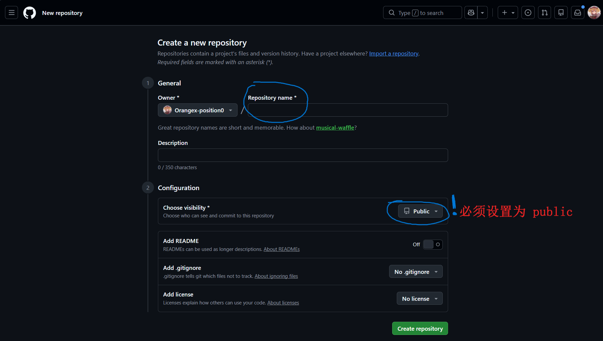
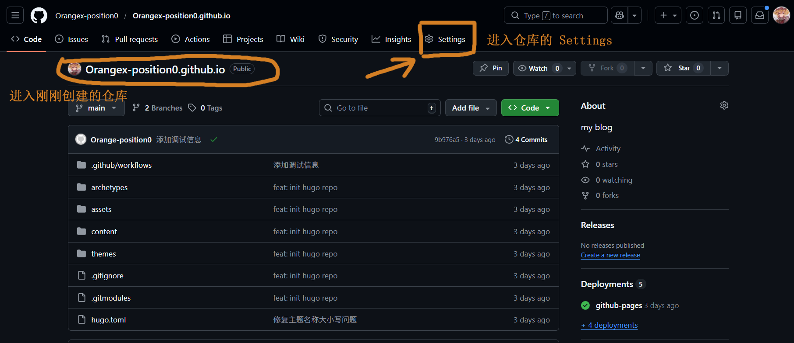
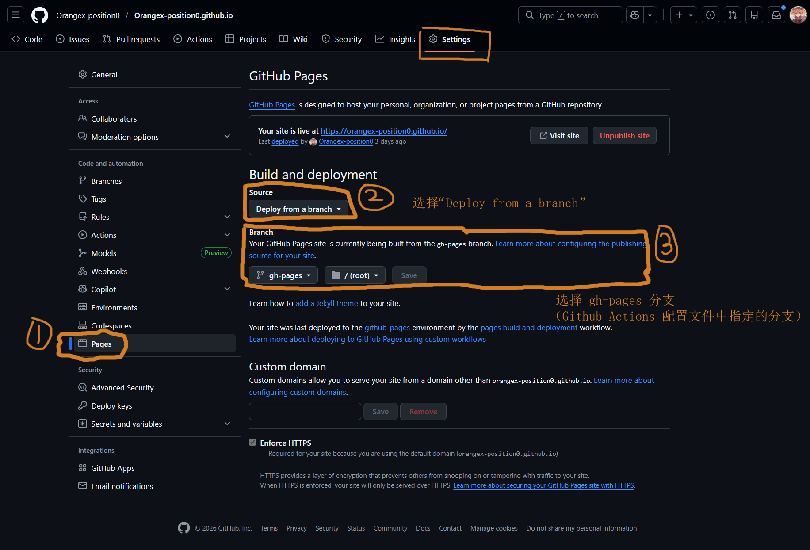

+++
title = 'Hugo 结合 Github Pages，部署你自己的静态博客'
date = 2026-03-18T22:30:00+08:00
draft = false
description = '从零开始，使用 Hugo 静态网站生成器和 GitHub Pages 搭建个人博客'

categories = ['blog']
tags = ['hugo', 'github-pages', 'static-site', 'blog', 'devops']
series = ''
seriesWeight = 0
+++


## 📖 读前概览

🎯 读完本篇文章，你将获得：
- 如何结合 Hugo 和 Github Pages，免费部署你自己的静态博客网站
- ⏱️ **预计阅读时间**：8 分钟

## Prerequisite（前置）

你需要先下载 hugo 本地

## 前言

Hugo 是一个基于 Go 语言的静态网站生成器，具有构建速度快、使用简单等特点。结合 GitHub Pages，我们可以免费部署一个美观的个人博客。本文将详细介绍从创建仓库到自动部署的完整流程。

## 一、创建 GitHub 仓库

首先，需要在 GitHub 上创建一个仓库来存放博客源码。

### 仓库名称建议

推荐使用 `<username>.github.io` 格式的仓库名，这样访问地址就是 `https://<username>.github.io/`，更加简洁。

> 例如：用户名是 `Claude`，仓库名就是 `Claude.github.io`

### 仓库设置

**仓库必须设置为 Public**，否则 GitHub Pages 无法正常访问。



## 二、配置 Hugo 项目

### 1. 修改 baseURL

编辑 Hguo 项目根目录下的 `hugo.toml` 文件，修改 `baseURL` 为你的 GitHub Pages 地址：

```toml
baseURL = 'https://<username>.github.io/'
```

### 2. 配置 .gitignore

在 Hugo 项目根目录创建 `.gitignore` 文件（如果不存在），添加以下内容：

```gitignore
# ==============================================================================
# Hugo 生成文件和缓存
# ==============================================================================
# 生成的静态网站目录
public/

# Hugo 资源处理缓存（图片压缩、SCSS 编译等）
resources/

# Hugo 构建锁文件
.hugo_build.lock

# ==============================================================================
# 操作系统和编辑器生成的文件
# ==============================================================================
# macOS
.DS_Store
.AppleDouble
.LSOverride

# Windows
Thumbs.db
ehthumbs.db
Desktop.ini

# Linux
*~

# 编辑器
.vscode/
.idea/
*.swp
*.swo
*.swn

# ==============================================================================
# 其他
# ==============================================================================
*.log
node_modules/
.env
```

这些配置确保只上传源代码，而不上传生成的静态文件。

## 三、配置 GitHub Actions 自动部署

GitHub Actions 可以在代码推送后自动构建和部署博客，无需手动操作。

### 创建工作流文件

在 Hugo 项目根目录创建 `.github/workflows/deploy.yml` 文件，作为 Github Actions 的配置文件

```yaml
# Workflow 名称
name: deploy

# 触发条件：当代码 push 到 main 分支时执行
on:
  push:
    branches:
      - main

jobs:
  deploy:
    # 运行环境：GitHub 提供的 Ubuntu 虚拟机
    runs-on: ubuntu-latest

    # 赋予 Action 向仓库写入内容的权限（用于推送 gh-pages 分支）
    permissions:
      contents: write

    steps:
      # 1. 拉取仓库代码
      - name: Checkout
        uses: actions/checkout@v4
        with:
          # 如果主题使用 git submodule 引入，需要递归拉取
          submodules: recursive
          # 获取完整 git 历史（某些主题或插件需要）
          fetch-depth: 0

      # 2. 安装 Hugo
      - name: Setup Hugo
        uses: peaceiris/actions-hugo@v3
        with:
          # 使用最新 Hugo 版本
          hugo-version: latest
          # 使用 extended 版本（支持 SCSS/SASS）
          extended: true

      # 3. 构建 Hugo 网站
      - name: Build
        # --gc 清理未使用缓存
        # --minify 压缩 HTML/CSS/JS，减少页面体积
        run: hugo --gc --minify

      # 4. 部署到 GitHub Pages
      - name: Deploy
        uses: peaceiris/actions-gh-pages@v4
        with:
          # 使用 GitHub 自动提供的 token，无需手动创建
          github_token: ${{ secrets.GITHUB_TOKEN }}
          # 要发布的目录（Hugo 构建输出目录）
          publish_dir: ./public
          # 发布到 gh-pages 分支（与源码 main 分离）
          publish_branch: gh-pages
          # 自动生成提交信息
          commit_message: "Deploy: ${{ github.sha }}"
```

### 工作流说明

这个配置文件做了以下几件事：

1. **Checkout**: 拉取代码和主题子模块
2. **Setup Hugo**: 安装最新版本的 Hugo extended
3. **Build**: 执行 `hugo --gc --minify` 构建网站
4. **Deploy**: 将 `public/` 目录推送到 `gh-pages` 分支

## 四、启用 GitHub Pages

1. 进入 GitHub 仓库的 **Settings** 页面



2. 在左侧菜单找到 **Pages**
3. 配置如下选项：
   - **Source**: 选择 `Deploy from branch`
   - **Branch**: 选择 `gh-pages` 分支
>⚠️注意，若没有 gh-pages 分支，可能是 Github Actions 执行失败，导致没创建分支



> 配置完成后，GitHub 会自动开始部署，几分钟后即可通过 `https://<username>.github.io/` 访问你的博客。

## 五、推送代码到 GitHub

### 首次推送

第一次推送代码到 `main` 分支时，GitHub Actions 会自动创建 `gh-pages` 分支并完成部署。

```bash
# 初始化 git 仓库（如果还没有）
git init

# 添加所有文件
git add .

# 提交
git commit -m "Initial commit"

# 添加远程仓库
git remote add origin https://github.com/<username>/<username>.github.io.git

# 推送到 main 分支
git push -u origin main
```

> ️⚠️**注意**：如果你本地的默认分支是 `master`，需要先改为 `main` 分支，因为 GitHub Actions 配置文件中指定的分支是 `main`。

```bash
# 重命名 master 为 main
git branch -M main
```

### 分支说明

- **main 分支**：存放纯净的 Markdown 源码和配置文件
- **gh-pages 分支**：存放生成的 HTML 静态文件（由 Actions 自动维护）

## 六、日常写作与发布

### 创建新文章

```bash
# 使用 Hugo 命令创建新文章
hugo new posts/my-new-post.md

# 或在分类目录下创建
hugo new posts/category/article-name.md
```

### 发布流程

1. 在本地编写文章（Markdown 格式）
2. 修改文章的 front matter，将 `draft = true` 改为 `draft = false`
3. 提交并推送到 GitHub：
   ```bash
   git add .
   git commit -m "Add new post"
   git push
   ```
4. GitHub Actions 自动构建并部署
5. 几分钟后访问你的博客，新文章已上线

## 七、总结

通过 Hugo + GitHub Pages 的组合，我们可以：

- **零成本**：完全免费托管
- **自动化**：推送即发布，无需手动构建
- **高性能**：Hugo 构建速度极快，生成的页面轻量
- **版本控制**：所有文章都在 Git 中管理，永不丢失
- **自定义主题**：丰富的 Hugo 主题生态

快快尝试搭建你的个人博客吧！

## 参考资料

- [Hugo 官方文档](https://gohugo.io/)
- [GitHub Pages 官方文档](https://pages.github.com/)
- [Stack 主题](https://github.com/CaiJimmy/hugo-theme-stack)
