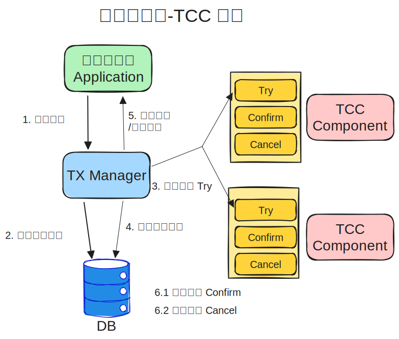
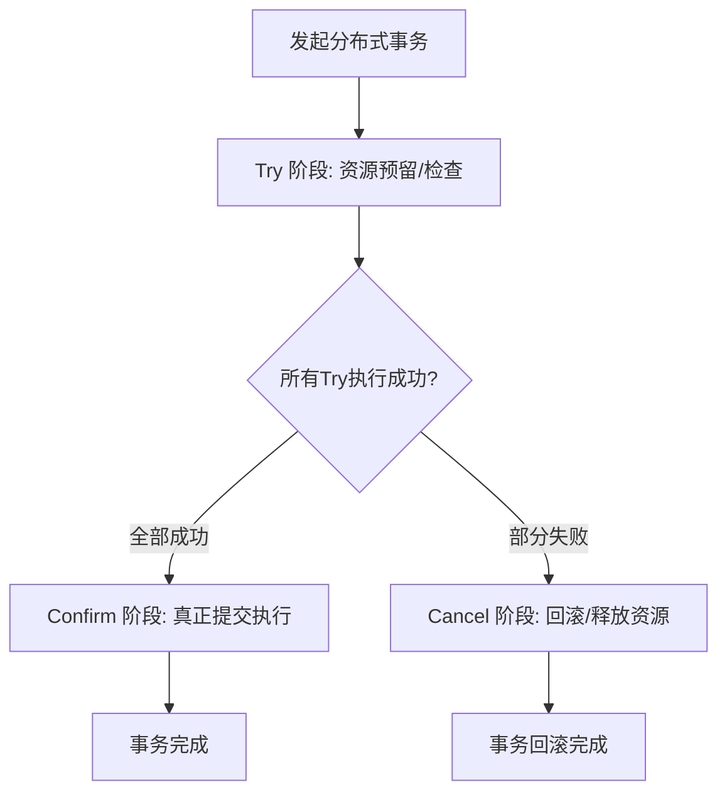

+++
title = '使用 TCC 模式处理分布式事务一致性'
date = 2026-05-26T19:10:00+08:00
draft = false
description = '介绍 TCC 分布式事务模式的核心思想、与 2PC 的对比、架构设计，以及幂等、空回滚、悬挂事务等关键实现问题的解决方案'

categories = ['distributed-systems']
tags = ['TCC', '分布式事务', '2PC']
+++

## 背景 & 问题

在分布式系统中，一个业务操作往往涉及多个服务。比如电商下单：库存服务扣减库存、订单服务创建订单、支付服务冻结金额。这些操作要么全部成功，要么全部失败——这就是**分布式事务**问题。

传统的单体应用可以用数据库事务（ACID）轻松解决，但分布式环境下，每个服务有自己的数据库，无法共享一个事务。常见的分布式事务方案有：

| 方案              | 核心思路                              | 主要问题                     |
| ----------------- | ------------------------------------- | ---------------------------- |
| 2PC（两阶段提交） | 协调者统一控制所有参与者的提交/回滚   | 同步阻塞、单点故障、性能差   |
| 3PC（三阶段提交） | 在 2PC 基础上增加"预提交"阶段降低阻塞 | 实现复杂，仍存在网络分区问题 |

这些方案依赖数据库层面的全局锁，在高并发场景下性能瓶颈明显。

本文将介绍 TCC（Try-Confirm-Cancel）模式——一种参考 2PC 思想、但不依赖全局锁的分布式事务方案。你将了解到：

- TCC 的核心思想和三阶段工作流程
- TCC 架构设计及其与 2PC 的对比
- 用资金转账场景演示 TCC 的完整实现
- 6 个实现中必须解决的关键问题及其解决方案

### 前置知识

阅读本文需要了解以下概念（不熟悉也没关系，文中会配合上下文说明）：

- **分布式事务**：跨多个服务或数据库的事务操作，需要保证数据一致性
- **最终一致性**：允许数据在短时间内不一致，但保证最终会达到一致状态
- **幂等性**：同一操作执行一次和多次产生的效果相同

## 方案或原理

### TCC 是什么

TCC（Try-Confirm-Cancel）是一种基于**业务补偿**的分布式事务解决方案。它将一个完整的业务操作拆分为三个阶段：

| 阶段        | 职责                  | 说明                                      |
| ----------- | --------------------- | ----------------------------------------- |
| **Try**     | 资源预留 / 可行性检查 | 冻结资源、检查前置条件，但不真正执行业务  |
| **Confirm** | 确认提交              | 真正执行业务操作，使用 Try 阶段预留的资源 |
| **Cancel**  | 取消回滚              | 释放 Try 阶段预留的资源，恢复到操作前状态 |

核心思想：**不依赖数据库全局锁，而是通过"资源预留 + 显式确认/取消"来控制事务状态**。

TCC 本质上是一个**带重试、可回滚的分布式状态机**。

### TCC vs 2PC

两者都采用"两阶段"的思想，但有本质区别：

| 维度     | 2PC                      | TCC                                         |
| -------- | ------------------------ | ------------------------------------------- |
| 锁机制   | 数据库全局锁             | 业务层面资源预留（无全局锁）                |
| 实现层面 | 数据库 / 中间件          | 业务代码（每个服务实现 Try/Confirm/Cancel） |
| 性能     | 同步阻塞，资源锁定时间长 | 无全局锁，并发性能好                        |
| 侵入性   | 对业务代码侵入低         | 需要业务代码配合实现三个阶段                |
| 适用场景 | 对一致性要求极高         | 高并发、短事务场景                          |

简单来说：2PC 让数据库来管锁，TCC 让业务代码自己管资源。

### TCC 架构



**核心组件**：

- **事务管理器（TM）**：发起分布式事务，决定全局提交或回滚
- **事务协调器（TC）**：协调各分支事务的 Try/Confirm/Cancel 执行
- **参与者（RM）**：各业务服务，实现 Try/Confirm/Cancel 三个接口

### TCC 通用流程



1. 事务管理器发起分布式事务
2. **Try 阶段**：所有参与者执行资源预留和可行性检查
3. 如果所有 Try 都成功，进入 **Confirm 阶段**，提交业务操作
4. 如果任何一个 Try 失败，进入 **Cancel 阶段**，释放资源并回滚

### 优缺点

**优势：**

- 性能高：避免数据库长事务与全局锁
- 隔离性好：资源预留后对其他事务不可见
- 保证最终一致性，支持回滚操作

**代价：**

- 实现复杂：每个业务需要实现三个接口
- 对幂等要求极高：网络重试可能导致重复调用

### 适用场景

- **高并发、短事务**：如电商下单、支付冻结
- **对一致性要求高**：如金融交易
- **不适合长事务**：资源会被长期冻结，影响系统性能

## 实现步骤

下面通过一个**资金转账**场景（A 账户向 B 账户转账 100 元）演示 TCC 的完整实现。

### 场景分析

涉及两个服务：

- **转出服务**：从 A 账户扣款
- **转入服务**：向 B 账户加款

### 1. Try 阶段：资源预留

Try 阶段不是真正扣款/加款，而是"冻结"对应金额。

```java
// 转出服务 - Try：冻结 A 账户 100 元
public boolean tryDeduct(String txId, String accountId, BigDecimal amount) {
    // 检查余额是否充足
    Account account = accountDao.findById(accountId);
    if (account.getBalance().compareTo(amount) < 0) {
        throw new InsufficientBalanceException("余额不足");
    }

    // 冻结金额（可用余额减少，冻结金额增加）
    accountDao.freeze(accountId, amount);

    // 记录事务日志（幂等控制）
    transactionLogDao.save(new TransactionLog(txId, "TRY", accountId));
    return true;
}

// 转入服务 - Try：预增加 B 账户 100 元（标记为待确认）
public boolean tryAdd(String txId, String accountId, BigDecimal amount) {
    // 预增加金额（标记为冻结状态，不可用）
    accountDao.preAdd(accountId, amount);

    transactionLogDao.save(new TransactionLog(txId, "TRY", accountId));
    return true;
}
```

关键点：Try 阶段通过"冻结"实现资源预留，而非真正执行业务。

### 2. Confirm 阶段：确认提交

所有 Try 成功后，执行真正的业务操作。

```java
// 转出服务 - Confirm：真正扣除冻结金额
public boolean confirmDeduct(String txId, String accountId, BigDecimal amount) {
    // 幂等检查：是否已执行过
    if (transactionLogDao.exists(txId, "CONFIRM")) {
        return true;
    }

    // 扣除冻结金额
    accountDao.deductFrozen(accountId, amount);

    transactionLogDao.save(new TransactionLog(txId, "CONFIRM", accountId));
    return true;
}

// 转入服务 - Confirm：将预增加金额转为可用
public boolean confirmAdd(String txId, String accountId, BigDecimal amount) {
    if (transactionLogDao.exists(txId, "CONFIRM")) {
        return true;
    }

    accountDao.confirmPreAdd(accountId, amount);

    transactionLogDao.save(new TransactionLog(txId, "CONFIRM", accountId));
    return true;
}
```

### 3. Cancel 阶段：回滚释放

任何一个 Try 失败时，所有参与者执行 Cancel 释放资源。

```java
// 转出服务 - Cancel：解冻金额
public boolean cancelDeduct(String txId, String accountId, BigDecimal amount) {
    if (transactionLogDao.exists(txId, "CANCEL")) {
        return true;
    }

    // 空回滚检查：Try 是否执行过
    if (!transactionLogDao.exists(txId, "TRY")) {
        transactionLogDao.save(new TransactionLog(txId, "CANCEL", accountId));
        return true;
    }

    // 解冻金额
    accountDao.unfreeze(accountId, amount);

    transactionLogDao.save(new TransactionLog(txId, "CANCEL", accountId));
    return true;
}

// 转入服务 - Cancel：撤销预增加
public boolean cancelAdd(String txId, String accountId, BigDecimal amount) {
    if (transactionLogDao.exists(txId, "CANCEL")) {
        return true;
    }

    if (!transactionLogDao.exists(txId, "TRY")) {
        transactionLogDao.save(new TransactionLog(txId, "CANCEL", accountId));
        return true;
    }

    accountDao.cancelPreAdd(accountId, amount);

    transactionLogDao.save(new TransactionLog(txId, "CANCEL", accountId));
    return true;
}
```

注意每个 Cancel 方法都包含了**幂等检查**和**空回滚检查**——这是 TCC 实现中最关键的两个防护机制。

## 示例 / 踩坑

TCC 的核心难点不在"正常流程"，而在各种异常场景下的正确处理。以下是 6 个实现中必须解决的问题。

### 1. 幂等问题

**问题**：网络超时后协调器会重试 Confirm/Cancel，可能导致同一操作被执行多次。例如：已经扣款的账户被再次扣款。

**解决**：

- **唯一事务 ID**：每次操作携带全局唯一的事务 ID
- **事务状态日志**：执行前检查该事务 ID 是否已执行过当前阶段
- **数据库防重**：通过唯一索引防止重复提交

每个 Confirm/Cancel 方法的开头都要做幂等检查：

```java
if (transactionLogDao.exists(txId, "CONFIRM")) {
    return true;
}
```

### 2. 空回滚

**问题**：Try 请求因网络丢包未到达参与者，但协调器因超时触发 Cancel。此时参与者的 Cancel 没有对应的 Try 操作，执行回滚逻辑会导致数据错误。

**解决**：

- Cancel 执行前检查 Try 是否已执行（查询事务日志）
- 如果 Try 未执行，直接记录日志并返回成功，不执行业务逻辑

```java
// 空回滚检查
if (!transactionLogDao.exists(txId, "TRY")) {
    transactionLogDao.save(new TransactionLog(txId, "CANCEL", accountId));
    return true;
}
```

### 3. 悬挂事务

**问题**：Try 请求网络延迟，Cancel 已经先于 Try 到达并完成（触发了空回滚）。随后延迟的 Try 才到达并执行成功，资源被冻结但无人推进事务——形成"悬挂"。

**解决**：

- **定时轮询监控**：后台任务周期扫描，识别长时间停留在 Try 阶段的事务并主动推进
- **MQ 异步补偿**：通过消息队列异步触发后续 Confirm/Cancel 操作，解耦并保障执行可靠性

### 4. 补偿失败

**问题**：自动补偿机制可能失效（如数据库宕机、代码 Bug），需要人工介入保证数据一致性。

**解决**：

- **预留补偿接口**：为 Try/Confirm/Cancel 分别提供可手动触发的补偿接口
- **事务状态查询接口**：供运维人员查询事务当前状态，判断是否需要补偿
- **补偿任务调度**：定时扫描未完成的事务分支，自动重试补偿

### 5. 超时处理

**问题**：受网络分区、服务宕机等影响，事务长期滞留于 Try 阶段，无法正常推进。

**解决**：设置事务超时时间，超时后自动标记为失败，触发 Cancel 回滚。

### 6. 协调者故障

**问题**：事务协调器是 TCC 的核心组件，一旦故障，所有进行中的事务都无法推进。

**解决**：

- 协调器集群部署，主节点故障后备用节点接管
- 提供管理后台，允许运维人员手动决定提交或回滚
- 持久化事务日志，恢复后可继续推进未完成的事务

### 常见 TCC 组件

| 组件 | 语言 | 特点 |
|------|------|------|
| [Apache Seata](https://seata.apache.org/) | Java | 功能全面，支持 AT/TCC/Saga/XA 四种模式 |
| [DTM](https://entiy.dtm.pub/) | Go | 支持多语言 SDK，轻量级 |
| [rust-tcc](https://github.com/Orangex-position0/rust-tcc) | Rust | 轻量级 TCC 实现 |

## 总结

本文介绍了 TCC 分布式事务模式的核心思想和实践方法，回顾要点：

1. **核心思路**：将事务拆分为 Try（资源预留）、Confirm（确认提交）、Cancel（取消回滚）三个阶段，通过业务补偿代替全局锁
2. **与 2PC 的区别**：TCC 在业务层面控制资源而非依赖数据库锁，性能更好但实现更复杂
3. **关键实现挑战**：幂等性、空回滚、悬挂事务、补偿失败、超时处理、协调者故障——每个都需要针对性的解决方案
4. **适用场景**：高并发短事务（电商下单、支付冻结），不适合长事务

TCC 不是银弹。如果你的系统事务简单、并发不高，可以考虑更轻量的方案（如本地消息表）。当系统确实面临"分布式事务 + 高并发"的瓶颈时，TCC 是一个值得投入的解决方案。
