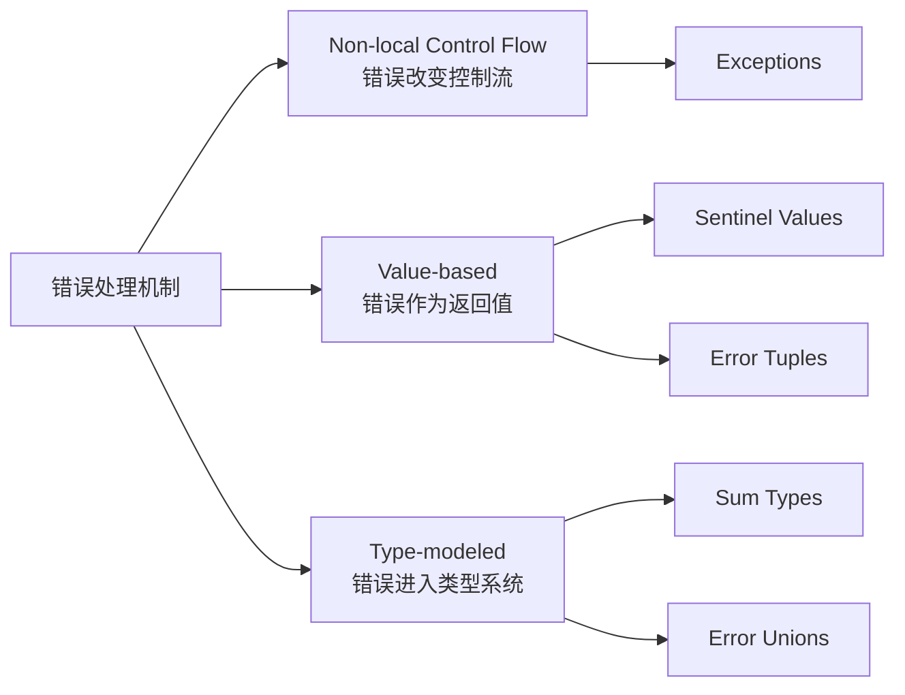
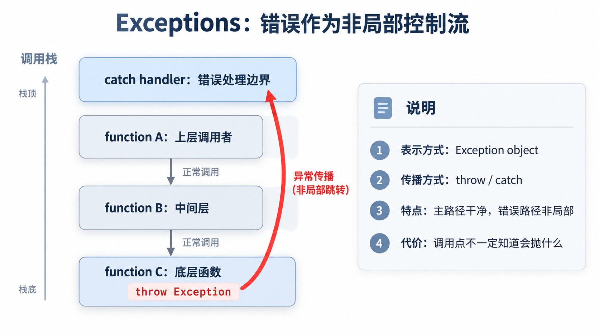
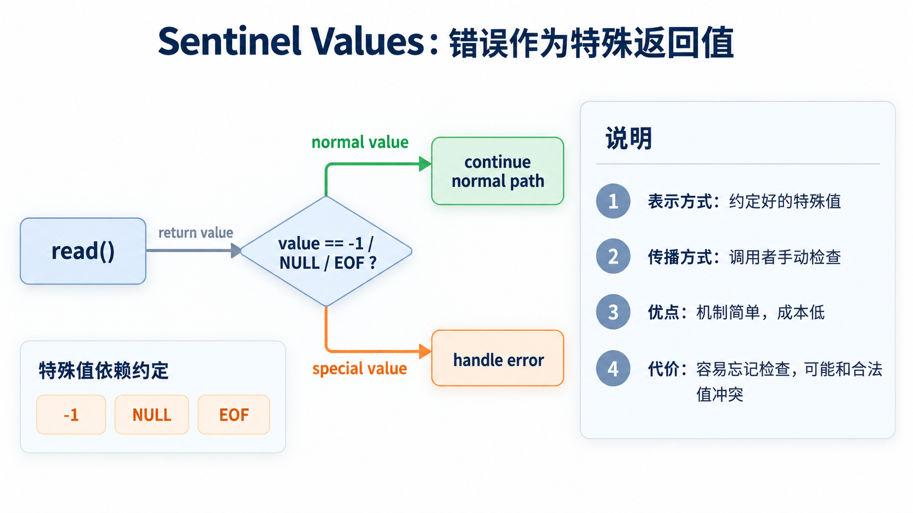
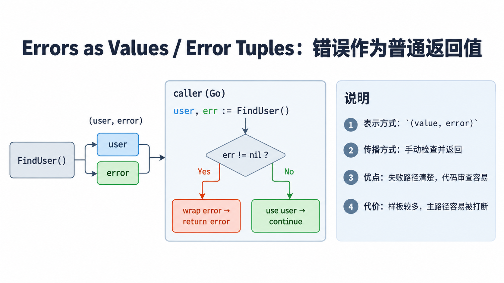
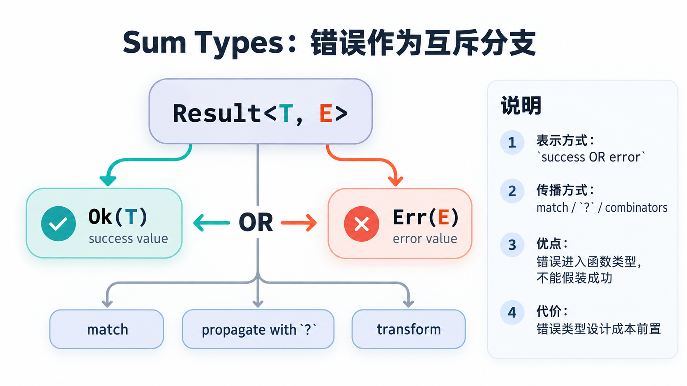
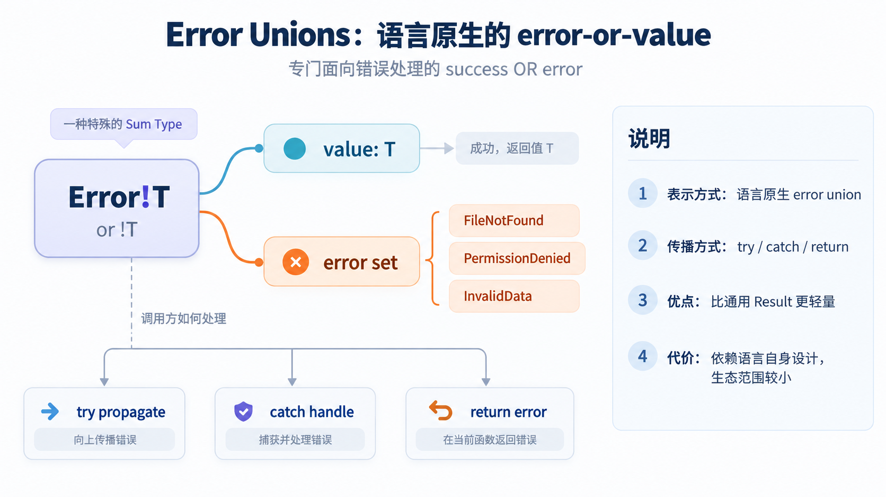

+++
title = '常见编程语言的错误处理方式对比'
date = 2026-09-10T00:00:00+08:00
lastmod = 2026-09-10T00:00:00+08:00
draft = false
image = 'cover.png'
description = '从异常、错误返回值、Result、Sum Type 和 Error Union 出发，对比 Java、Go、Rust、Python、TypeScript/JavaScript 等语言的错误处理设计。'

categories = ['programming-language']
tags = ['error-handling', 'java', 'go', 'rust', 'typescript', 'python']
+++

# 常见编程语言的错误处理方式对比

> 先说明，笔者主要以后端开发视角来讨论，比较熟悉 Java、Go 和 Rust。本文也会顺带提到 Python、TypeScript/JavaScript、Swift、Kotlin、Scala、Haskell、Zig 等语言，但重点不是做语言百科（因为我大部分也不会……），而是比较不同错误处理设计背后的取舍。

最近刷面经时，我看到过这样一道问题：

> 你简历上写了不止一种编程语言。那你能不能对比一下，这几门语言的错误处理方式有什么不同？

这个问题看起来很普通，好像只是在问类似 Java 的 `try-catch-finally`、Go 的 `if err != nil`、Rust 的 `Result<T, E>`。但如果继续追问下去，它其实会变成一个更底层的问题：

**一门语言到底希望程序员如何处理失败？**

是让正常路径保持干净，把失败作为异常抛给上层？还是把失败作为普通返回值，让调用者在每个调用点显式判断？或者把可恢复失败写进类型系统，让编译器逼你承认它？

所以这篇文章不只是罗列语法，而是想借几门常见语言，梳理主流错误处理模型，以及它们在 API 契约、控制流、类型系统和工程实践里的取舍。

## 1. 为什么错误处理值得单独讨论

错误处理不是一个“语法小节”。它会直接影响代码的形状。

比如同样是读取一个配置文件，失败时可能有几种写法：

Java 代码：

```java
try {
    Config config = loadConfig(path);
} catch (IOException e) {
    throw new ConfigException("failed to load config", e);
}
```

Go 代码：

```go
config, err := LoadConfig(path)
if err != nil {
    return fmt.Errorf("load config: %w", err)
}
```

Rust 代码：

```rust
let config = load_config(path)
    .context("failed to load config")?;
```

这几段代码背后的问题并不只是语法不同，而是语言在帮我们回答这些问题：

- 调用者能不能从函数签名看出这里可能失败？
- 失败会不会中断当前控制流，并跳到别的地方？
- 调用者是否必须处理失败？
- 错误是业务分支、外部环境失败，还是程序 bug？
- 错误应该在当前层处理，还是传到 HTTP handler、CLI main、任务调度器这类边界统一处理？
- 日志、重试、降级、资源清理应该放在哪里？

所以对比错误处理方式，本质上是在比较不同语言如何处理同一个矛盾：

**正常路径越干净，错误路径往往越隐蔽；错误路径越显式，主路径往往越容易被打断。**

## 2. 错误处理机制分类

先不急着按语言对比。更好的方式是先按机制分类，因为很多语言不是只有一种错误处理方式，而是在不同场景下组合使用多种机制。

大体上，常见错误处理机制可以分成三组：



| 类别                        | 机制            | 核心想法                                 | 典型语言或风格                                              |
| --------------------------- | --------------- | ---------------------------------------- | ----------------------------------------------------------- |
| Non-local control flow      | Exceptions      | 错误脱离普通返回路径，沿调用栈传播       | Java、C#、Python、JavaScript、C++                           |
| Value-based error handling  | Sentinel Values | 用约定好的特殊值表示失败                 | C 风格 API、系统调用、部分标准库 API                        |
| Value-based error handling  | Error Tuples    | 错误作为普通返回值返回                   | Go、Odin                                                    |
| Type-modeled error handling | Sum Types       | 用类型表达 `success OR error`            | Rust、Haskell、Scala、TypeScript union、Kotlin sealed class |
| Type-modeled error handling | Error Unions    | 语言原生提供专用的 `error OR value` 类型 | Zig、C3                                                     |

### 2.1 Exceptions：错误作为非局部控制流



Exception 的核心设计是：**失败不通过普通返回值返回，而是通过 `throw` 改变控制流，沿调用栈向上传播，直到遇到能处理它的 `catch`。**

典型语言包括 Java、C#、Python、JavaScript/TypeScript 和 C++。

比如下面这段 Java 代码：错误被 catch 并处理，而不是作为函数返回值被处理

```java
try {
    User user = userService.findById(id);
    return Response.ok(user);
} catch (UserNotFoundException e) {
    return Response.status(404).body(e.getMessage());
}
```

异常的好处很直观：正常路径很干净。中间层如果没有处理能力，可以不在每一层手动判断错误，而是让异常继续向上传播，到真正有上下文的位置统一处理。

这也是为什么 Web 框架、RPC 框架、任务调度框架经常喜欢用全局异常处理器：service 层抛出异常，controller advice、middleware 或 handler 在边界把异常转换成 HTTP 响应、日志、告警或退出码。

但异常的代价也来自同一个地方：错误路径是非局部的。调用点看起来只是普通函数调用，但执行过程中可能突然跳出当前流程。除了 Java checked exception 这类特殊设计，多数语言的异常集合不会进入函数签名。调用者想知道一个函数可能抛什么异常，往往只能依赖文档、源码、测试和经验。

所以异常很适合“跨层传播”和“边界统一处理”，但不适合所有失败。比如缓存 miss、查找不到、表单字段校验失败这些高频普通分支，如果全部用异常表达，代码语义会变重，性能和可读性也可能受影响。

### 2.2 Sentinel Values：错误作为特殊返回值



Sentinel Value 的核心设计是：**用约定好的特殊返回值表示失败。**

比如 C 风格 API 中常见的 `NULL`、`-1`、`EOF`，或者某些 API 用空字符串、特殊 enum 表示失败。

```c
int fd = open(path, O_RDONLY);
if (fd == -1) {
    // handle error
}
```

这种方式非常朴素：没有额外语言机制，也不需要异常系统或类型系统配合。函数就是返回一个值，调用者按约定检查这个值。

问题也很明显：它太依赖约定。调用者忘记检查，编译器通常不会提醒；特殊值还可能和合法值冲突。比如 `-1` 到底是错误，还是一个合法业务值？`null` 到底表示不存在，还是出错，还是没有加载？

因此 Sentinel Value 更适合非常局部、非常简单、约定足够稳定的场景。现代业务代码里，最好不要让这种特殊值穿过复杂业务边界，否则错误语义很容易丢失。

### 2.3 Errors as Values / Error Tuples：错误作为普通返回值



Go 是这一类设计最典型的代表。它的核心设计是：**把错误作为普通返回结果，让调用者在每个调用点显式处理。**

```go
user, err := repo.FindUser(ctx, id)
if err != nil {
    return nil, fmt.Errorf("find user %s: %w", id, err)
}

return user, nil
```

Go 官方文章《Errors are values》里有一个很重要的视角：错误不是特殊语法，错误就是普通值。既然是普通值，它就可以被传递、包装、比较、转换，也可以进入普通控制流。

这让 Go 的失败路径非常可见。代码审查时，一眼就能看到调用方有没有检查 `err`，有没有补充上下文，有没有把错误吞掉。

代价是样板明显。大量 `if err != nil` 会把主路径切碎。如果只是机械地 `return err`，虽然形式上显式了，但错误里缺少上下文，排查问题时仍然很痛苦，这也是很多人写 Go 时抱怨的一个点。

另外，Go 的 `error` 本质上是接口。函数签名能告诉你“这里可能失败”，但不能精确告诉你“会失败成哪些类型”。如果调用方需要识别错误类别，就要靠 sentinel error、自定义 error type、`errors.Is`、`errors.As` 和团队约定来维持一致性。

所以 Go 的错误处理不是“更啰嗦的异常”，而是一种设计选择：把失败放回普通控制流，让调用者在当前上下文里决定是重试、降级、包装后返回，还是立即处理。

### 2.4 Sum Types：错误作为互斥分支



Sum Type 的核心设计是：**用类型表达 `success OR error` 两种互斥状态，让调用者不能把失败当作成功使用。**

Rust 的 `Result<T, E>` 是最容易理解的例子，下面是 `Result` 的源码：表示结果只能有两种状态，成功或失败。

```rust
enum Result<T, E> {
    Ok(T),
    Err(E),
}
```

一个可能失败的函数可以返回 `Result`：

```rust
fn load_config(path: &str) -> Result<Config, ConfigError> {
    let content = std::fs::read_to_string(path)?;
    parse_config(&content)
}
```

这里的错误也是看作返回值，但它和 Go 的 `(T, error)` 有一个关键差别：成功值和失败值是互斥分支。你拿到的是一个 `Result`，必须处理、转换、匹配，或者向上传播。

Rust 还会明确区分两类失败：

| 类型                | 含义                                                                        | 典型表达       |
| ------------------- | --------------------------------------------------------------------------- | -------------- |
| recoverable error   | **预期内的失败**，调用方有机会恢复、重试、降级，或选择替代路径              | `Result<T, E>` |
| unrecoverable error | **无法安全继续的错误**，程序进入不应继续的状态，通常代表 bug 或不变量被破坏 | `panic!`       |
| absence             | **没有错误细节的缺值**，只关心“有没有”而不是“为什么失败”                    | `Option<T>`    |

这类设计的优点是错误进入了函数类型。尤其当错误集合用 enum 表达时，模式匹配可以配合**穷尽性检查**：如果未来新增一种错误分支，编译器更容易提醒调用方还有地方没处理。

代价是 API 设计压力更前置。你需要决定错误类型长什么样、底层错误要不要暴露、跨模块错误如何转换、库层和应用层是否使用不同错误抽象。错误建模太粗，类型约束价值有限；建模太细，调用链又会变得笨重。

### 2.5 Error Unions：语言原生的 error-or-value



Error Union 和 Sum Type 思路接近，但它不是用通用 ADT 自己建模，而是由语言直接提供面向错误处理的专用机制。

以 Zig 为例，函数返回类型可以写成 `Error!T`，表示结果要么是错误集合里的某个错误，要么是成功值 `T`。

```zig
fn loadConfig(path: []const u8) !Config {
    const file = try std.fs.cwd().openFile(path, .{});
    defer file.close();

    return parseConfig(file);
}
```

这种方式的核心设计是：**语言原生支持 `error OR value`，让错误进入返回类型，同时保留轻量的传播语法。**

它比手写 `Result<T, E>` 更贴近错误处理场景，也比隐式异常更容易看见失败路径。不过这类机制目前主要存在于 Zig、C3 等语言中，生态范围和主流语言相比还比较小。

## 3. 错误处理范式与取舍

上一章讨论的是机制，这一章讨论背后的设计哲学。因为真正写代码时，问题通常不是“该用哪种语法”，而是“这个失败应该被建模成什么”。

### 3.1 异常范式：失败是非局部控制流

代表语言或风格：`Java`、`C#`、`Python`、`JavaScript`、`C++`

异常范式的核心取舍是：**让正常路径保持连续，把失败交给更有上下文的上层处理。**

这套思想非常适合分层应用。底层函数发现文件不存在、数据库连接失败、权限不足时，不一定知道该如何恢复；真正能决策的位置可能是 HTTP handler、CLI 入口、消息消费入口或事务边界。

异常让中间层不必机械传递错误，主流程看起来更接近业务叙事，比如下面这段 python 代码：

```python
def handle_request(user_id: str):
    user = user_service.get_user(user_id)
    orders = order_service.list_orders(user)
    return render_profile(user, orders)
```

但问题是，失败路径隐藏起来了。`get_user` 可能抛认证异常、数据库异常、用户不存在异常，也可能抛一个意料之外的运行时异常。如果函数签名和文档不说，调用者很难只靠调用点判断。

所以异常范式的关键不是“抛得越多越好”，而是分层：中间层可以传播，边界层必须负责转换；真正可恢复、需要调用方分支决策的失败，不应该只藏在一个宽泛异常里。

### 3.2 显式返回范式：错误是普通返回值

代表语言或风格：`Go`、`Odin`

显式返回范式的核心取舍是：**把错误作为普通返回结果，让调用者在每个调用点显式处理。**

它拒绝“失败突然跳走”的控制流。函数返回什么，调用者就检查什么；调用者有当前上下文，也最适合决定下一步。

这在基础设施代码里尤其有价值。比如一个 RPC 调用失败，当前层可能要决定是否重试；一个缓存读取失败，当前层可能要决定是否降级到数据库；一个文件解析失败，当前层可能要补充文件路径、行号、任务 ID 等上下文。

显式返回的优势是清楚，代价是对于主路径来说“噪声多”。它把错误处理放在主路径旁边，读者不会错过，但也容易被大量错误分支打断。

因此 Go 代码质量的关键不只是写 `if err != nil`，而是每次传播时都想清楚：这里要不要恢复？要不要包装上下文？调用方未来是否需要用 `errors.Is` 或 `errors.As` 识别它？

### 3.3 类型驱动范式：可恢复失败进入类型

代表语言或风格：`Rust`、`Haskell`、`OCaml`、typed `Result` 风格

类型驱动范式的核心取舍是：**把可恢复失败纳入函数返回类型，让调用者必须面对 `success OR error` 两种可能。**

它和普通错误返回有相似之处：失败仍然是返回值。但它更进一步，把失败变成函数类型的一部分。

这带来两个好处。

第一，调用者不能假装没有失败。一个 `Result<User, FindUserError>` 不是 `User`，你必须处理它。

第二，错误集合如果是封闭的，就可以借助模式匹配对错误做穷尽性处理：

```rust
match repo.find_user(id) {
    Ok(user) => render(user),
    Err(FindUserError::NotFound) => render_404(),
    Err(FindUserError::PermissionDenied) => render_403(),
    Err(FindUserError::Storage(err)) => render_500(err),
}
```

这对业务规则、协议解析、编译器、状态机和工作流非常有价值，因为这些场景下“失败有哪几种”本身就是领域模型的一部分。

代价也很明确：错误类型设计会提前变成 API 设计问题。库作者需要决定哪些错误是稳定契约，哪些只是内部实现细节。错误类型越精确，调用者拿到的信息越多，但 API 演化成本也越高。

### 3.4 显式传播范式：调用点必须标记失败

代表语言或风格：`Swift`、带显式 `try` 标记的错误传播模型

显式传播范式的核心取舍是：**让调用者看见失败传播，但不一定把完整错误集合冻结进函数类型。**

Swift 的 `throws` 是很典型的例子。调用一个可能失败的函数时，调用点必须写 `try`：

```swift
let config = try loadConfig(path)
```

这比 unchecked exception 更显式，因为读代码的人至少能看到“这里可能失败”。但它又不像 Rust 的 `Result<T, E>` 那样，默认把具体错误集合写进返回类型。

这种设计站在异常和类型化错误之间：传播是显式的，错误集合保持开放。好处是库作者更容易演化 API；代价是调用者知道这里可能失败，却未必知道具体会失败成哪些类型。

### 3.5 函数式范式：失败是可组合的数据

代表语言或风格：`Haskell`、`Scala`、TypeScript 的 `Result` union、Kotlin sealed class

函数式范式的核心取舍是：**把错误从控制流变成数据流，让失败路径可以被组合、转换和测试。**

在这种视角下，错误不是一次“跳转事件”，而是一个普通数据结构。它可以被 `map`、`flatMap`、组合、聚合，也可以作为领域模型的一部分传递。

TypeScript 里常见的 discriminated union 就很适合表达业务失败：

```ts
type RegisterResult =
    | { ok: true; userId: string }
    | { ok: false; reason: "email_taken" | "weak_password" | "invalid_invite" };

function render(result: RegisterResult) {
    if (result.ok) {
        return showSuccess(result.userId);
    }

    return showError(result.reason);
}
```

这类写法特别适合表单校验、协议解析、领域规则、状态机和工作流。因为调用方真正关心的不是“有没有异常”，而是“失败是哪一种，下一步应该怎么走”。

代价是抽象重量更高。简单逻辑如果过度套上 `Either`、`Result`、effect system 或复杂 helper，反而会让代码变难读。函数式错误处理最好用在失败路径本身需要组合和建模的地方。

### 3.6 现代错误处理的分层趋势

“传统”和“现代”不能简单按语言年龄划分。C++ 很老，但 RAII、`std::expected` 体现了很现代的错误处理思想；TypeScript 很新，但运行时仍然继承 JavaScript 的动态异常模型。

更准确的分水岭，是看失败是否显式进入 API 契约：

| 问题                     | 传统异常倾向                              | 现代类型化倾向                                  |
| ------------------------ | ----------------------------------------- | ----------------------------------------------- |
| 失败是否进入函数类型     | 通常不进入，Java checked exception 是例外 | `Result`、`Either`、sealed class、union 会进入  |
| 调用点是否显式           | unchecked exception 通常不显式            | `?`、`try`、`if err != nil`、pattern match 显式 |
| 错误集合是否可穷尽       | catch 少数 case，其余泛化处理             | enum、ADT、union 鼓励穷尽                       |
| API 演化成本             | 错误集合较隐式，演化轻一些                | 错误类型越精确，演化成本越高                    |
| bug 和可恢复失败是否分开 | 依赖实践和约定                            | Rust 最明确，Go 也区分 `error` 和 `panic`       |

现代错误处理不是简单消灭异常，而是更强调分层：

- 业务失败：尽量显式、机器可读，适合错误码、错误枚举、`Result`、union、sealed class。
- 外部环境失败：保留 cause 和上下文，逐层传播，在边界转换成日志、响应、重试或告警。
- 程序 bug：尽早暴露，使用 `panic`、assert、unchecked exception 或 fail fast。

这也是我理解的核心趋势：异常没有消失，只是从“所有失败的默认答案”，逐渐回到更合适的位置。

## 4. 为什么现代错误处理越来越强调显式失败

讨论到这里，容易得出一个过度简化的结论：现代语言是不是都在反对异常？

我觉得不是。更准确的说法是：现代错误处理越来越强调**把调用者需要决策的失败显式暴露出来**。

原因主要有三个。

第一，API 边界越来越重要。服务化、SDK、开放 API、微服务让错误经常跨过进程、网络、语言和团队边界。这个时候，错误如果只是一段 message 或隐式异常，调用者很难稳定分支。

第二，并发和异步让隐式失败更危险。同步调用里，异常还有一条相对直观的调用栈；但进入 Promise、goroutine、线程池、异步任务之后，失败可能发生在另一个时间点或另一个执行单元里。显式错误结果、结构化并发和 typed result 的价值，在于让失败可以被等待、组合、聚合，并和取消、超时一起处理。

第三，业务失败需要机器可读，而不是人类可读 message。用户名重复、余额不足、权限不足、库存不足这类失败通常不是程序事故，而是业务分支。它们需要被前端展示、国际化、统计、重试或引导用户操作，所以更适合被建模成错误码、错误枚举或领域错误类型。

所以问题不是“异常 vs 返回值”二选一，而是：这个失败到底应该由谁看见、谁处理、谁负责转换成用户或系统能理解的结果。

## 5. 如果面试中被问到：如何对比几门语言的错误处理？

那么回到文章开头提到的面试题：“你简历上写了几门语言，那对比一下它们的错误处理方式”，不要急着背语法。更好的回答方式，是先给出比较维度，再把语言放进去。

可以这样回答：

> 我会从“错误是否显式”“调用方是否被强制处理”“错误是否进入 API 契约”这几个角度对比。
>
> Java 主要依赖异常。checked exception 会进入方法签名，能表达一部分可恢复失败契约；unchecked exception 则更像隐式的非局部控制流，适合跨层传播并在边界统一处理。Python 和 JavaScript 也主要使用异常，不过异常集合通常不进入函数签名，更多依赖文档、测试和约定。
>
> Go 把错误作为普通返回值，调用者通常在每个调用点显式判断。它的控制流很清楚，代码审查也容易发现错误有没有被处理，但会带来重复的 `if err != nil`，而且错误分类依赖约定。
>
> Rust 更进一步，把可恢复错误放进 `Result<T, E>`，借助类型系统和 `?` 传播，让失败路径既显式又能被编译器检查。TypeScript、Kotlin、Scala 也可以用 union、sealed class、Either/Result 这类方式，把业务失败建模成数据。
>
> 所以我理解错误处理的重点不是哪种语法更高级，而是先判断失败的性质：调用者能恢复的失败应该显式建模，跨层的系统失败可以在边界统一处理，程序 bug 则应该尽早暴露。

如果面试官继续追问，可以按下面四个维度展开：

| 维度                 | 可以怎么说                                                                                                                                 |
| -------------------- | ------------------------------------------------------------------------------------------------------------------------------------------ |
| 错误如何表示         | Java、Python、JavaScript 常用异常对象；Go 用 `error` 返回值；Rust 用 `Result<T, E>`；TypeScript 可以用 union type 表达业务失败。           |
| 错误如何传播         | 异常会沿调用栈自动传播；Go 需要手动返回；Rust 可以用 `?` 显式传播；JavaScript 异步场景里还要处理 Promise rejection。                       |
| 调用方是否被强制处理 | Java checked exception、Rust `Result`、Swift `try` 更强调调用点可见；unchecked exception、Python、JavaScript 更依赖约定。                  |
| 适合什么场景         | 异常适合跨层传播和边界统一处理；显式返回适合调用者要立即决策的失败；类型化错误适合业务规则、协议解析、编译器、工作流等需要穷尽处理的场景。 |

最后给出自己的判断，会比单纯罗列语言更好：

> 我不认为存在一种绝对最好的错误处理机制。关键是先区分错误性质：业务失败、外部环境失败、程序 bug。业务失败应该尽量显式、机器可读；外部环境失败要保留上下文，并在合适的边界转换成日志、响应或重试策略；程序 bug 则应该 fail fast。不同语言的差异，本质上是在“主流程简洁性、错误路径显式性、API 契约稳定性、类型系统约束”之间做取舍。

## 6. 总结

错误处理方式的差异，表面上是 `try-catch`、`if err != nil`、`Result`、`throw` 的差异，本质上是语言设计哲学的差异。

- 异常范式追求主路径简洁，适合跨层传播和边界统一处理，但错误路径容易隐藏。
- 显式返回范式把失败放回普通控制流，调用点清楚，但会带来样板和噪音。
- 类型驱动范式把可恢复失败纳入函数类型，让编译器参与错误处理，但也要求更认真地设计错误模型。
- 函数式范式则进一步把失败当作可组合的数据，适合复杂领域建模和工作流。

我现在更倾向于用一个分层原则来选择错误处理方式：

- 调用方能恢复、需要分支决策的失败，应该显式建模。
- 外部环境失败，应该保留上下文，并在系统边界统一转换。
- 违反程序不变量、无法安全继续的状态，应该尽早暴露。
- 不要解析错误 message 做业务判断，也不要每一层都重复 log 同一个错误。

这样看，错误处理就不再是“哪门语言更优雅”的争论，而是一个 API 设计问题：你希望失败在哪里被看见，被谁处理，以及以什么形式进入系统契约。

## References

- [Java Language Specification, Chapter 11 Exceptions](https://docs.oracle.com/en/java/javase/26/docs/specs/jls/jls-11.html)
- [Rust Book, Error Handling](https://doc.rust-lang.org/stable/book/ch09-00-error-handling.html)
- [Go Blog, Errors are values](https://go.dev/blog/errors-are-values)
- [Go FAQ, Why does Go not have exceptions?](https://go.dev/doc/faq#exceptions)
- [TypeScript Handbook, Narrowing and Exhaustiveness](https://www.typescriptlang.org/docs/handbook/2/narrowing.html)
- [Python Tutorial, Errors and Exceptions](https://docs.python.org/3.12/tutorial/errors.html)
- [Swift Evolution, Error Handling Rationale and Proposal](https://github.com/swiftlang/swift-evolution/blob/main/proposals/0000-error-handling-rationale-and-proposal.md)
- [Microsoft Framework Design Guidelines, Exceptions](https://learn.microsoft.com/en-us/dotnet/standard/design-guidelines/exceptions)
- [什么是正确的错误处理方法【让编程再次伟大#21】_哔哩哔哩_bilibili](https://www.bilibili.com/video/BV1gJS9YeEsz/)
- [Exploring the ways different languages handle errors - YouTube](https://www.youtube.com/watch?v=zOUsVf1LsKg)
