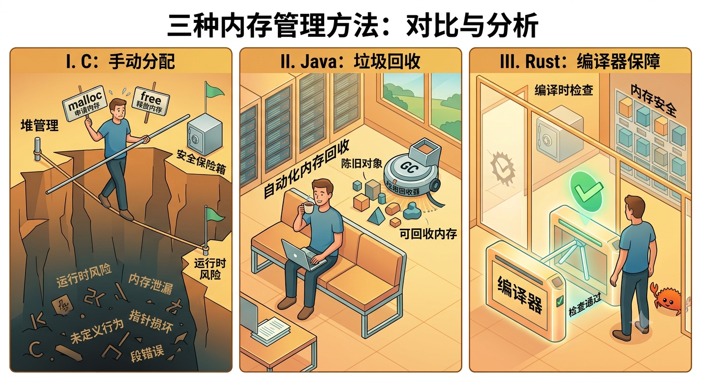

+++
title = '如果你来设计一门语言：Rust 内存模型是怎么想出来的'
date = 2026-07-01T10:00:00+08:00
draft = false
description = '从 C 的凌晨三点崩溃说起，看 Rust 如何用所有权、借用、Option 三件套，把内存错误挪到编译期'

categories = ['rust']
tags = ['rust', 'memory-model', 'ownership', 'borrowing']
series = ''
seriesWeight = 0
+++


## 凌晨三点的 segfault

2014 年 4 月，OpenSSL 爆出 Heartbleed。一个缓冲区越界读漏洞，让攻击者可以一遍遍抠出服务器进程的内存碎片，里面有机票订单、Session Cookie，甚至私钥。整个互联网紧急停摆，CVE 编号 CVE-2014-0160。

这并不是孤例。微软和 Google 的内部统计都显示，约 70% 的安全漏洞本质上是内存安全问题。

凌晨三点，你的 C 服务挂了。日志里写着 `segmentation fault (core dumped)`。你打开 gdb，看到一个悬垂指针，指向一块已经被释放的内存。

这种事系统程序员干了三十年。

于是有人开始问一个怪问题：**能不能设计一门语言，从语法上就不让这类错误发生？**

Java 和 Go 选了 GC，安全但运行时不可控。Rust 走了第三条路：把所有内存错误在编译期挡住，运行时零成本。

这条路是怎么想出来的？

## 内存管理要回答的三个问题

任何一门语言，处理内存都要回答三个问题：

1. 谁来分配和释放？
2. 怎么共享同一块内存？
3. 怎么避免访问到无效内存？

第一个问题的三种主流答法，基本定义了一门语言的性格：

| 方案                   | 思路                   | 优点                   | 代价                         |
| ---------------------- | ---------------------- | ---------------------- | ---------------------------- |
| **手动管理** (C)       | 程序员自己 malloc/free | 极致控制，零运行时开销 | 内存泄漏、双重释放、悬垂指针 |
| **垃圾回收** (Java/Go) | 后台 GC 自动清理       | 开发门槛低             | STW 停顿、内存峰值不可控     |
| **所有权** (Rust)      | 编译期插入释放代码     | 兼顾安全与性能         | 学习曲线陡                   |



后面三节分别对应这三个问题。Rust 的答案放在一起看才显得天才：单独拿任何一条出来都不新鲜，组合在一起就是另一回事。

## 第一道：谁来分配和释放？

### 所有权的三条规则

Rust 的答案叫 Ownership，规则只有三条：

1. 每个值在任意时刻有且只有一个 owner
2. 当 owner 离开作用域，值被自动释放
3. 把值赋给别人，所有权 move，原变量失效

三条加在一起，编译器就能在编译期精确推导每一块内存什么时候该释放。不需要引用计数，不需要 GC 扫描，不需要程序员手写 free。

### 一个最小的例子

```rust
{
    let s = String::from("hello");
    // s 是这块堆内存的 owner
}
// 离开作用域，String 的 drop 自动被调用，内存释放
```

`drop` 是编译器在作用域结束处自动插入的。这就是"零运行时开销"的真正含义：最终的机器码和你手写 free 一模一样，只是时机被编译器替你算好了。

### Move 语义：赋值后原变量为什么不能用了

```rust
let s1 = String::from("hello");
let s2 = s1;

println!("{}", s1);  // 编译错误：s1 已经被 move 了
```

C++ 程序员看到这段代码会本能地紧张：s1 和 s2 是不是指向同一块内存？析构的时候会不会 double free？

Rust 的回答简单粗暴：**所有权已经 move 到 s2 了，s1 不再有效，编译器直接拒绝编译**。

这看起来别扭，但它解决了一个根本问题：如果两个变量都能访问同一块堆内存，谁负责释放？引用计数？GC？Rust 选择不让这种情况在默认情况下发生。

### 对照：C 的 use-after-free

```c
char *s = malloc(10);
free(s);
printf("%s\n", s);  // 未定义行为，可能崩溃，也可能默默错下去
```

这种 bug 在 C 里能跑很久才暴露，等到暴露时已经不知道是谁的锅。Rust 里它根本编译不过。

## 第二道：怎么共享内存？

如果所有权严格只能 move，那很多场景就难办了。函数传参怎么办？是不是每次调用都要把所有权交出去再还回来？

Rust 的答案是 **借用 (borrowing)**。所有权不交出去，只把使用权临时借出去。

### 借用规则

借用有两条铁律：

1. 任意时刻，可以有 **多个不可变引用** `&T`
2. 或者 **一个可变引用** `&mut T`，两者不能共存

这两条规则强制实现了一个不变量：**同一时间，要么多人读，要么一人写，不能同时发生**。

### 这条规则顺手杀死了 data race

数据竞争 (data race) 在多线程编程里是出了名的难调。两个线程同时改一个变量，没有锁保护，结果完全不可预测。

但仔细想想：data race 的本质，就是"同时存在两个引用，且其中一个是 `&mut`"。Rust 的借用规则在编译期就把这种情况挡死了。

```rust
let mut v = vec![1, 2, 3];
let r1 = &mut v;
let r2 = &mut v;  // 编译错误：不能同时有两个 &mut

r1.push(4);
```

这段代码编译不过。换 Java 它会跑得很欢，然后在某个深夜因为竞态条件挂掉。

### 一个类比

想象一块白板。借用规则说：要么一群人围观白板（多个 `&`），要么一个人独自擦写（一个 `&mut`）。前者保证白板内容不被改，后者保证没人看到擦一半的中间状态。这两件事在物理上不能同时发生，Rust 把这个物理常识编进了语言。

## 第三道：怎么避免无效内存？

无效内存主要来自两种情况：**空指针** 和 **data race**。后者借用规则已经顺手解决了，剩下的就是空指针。

### Rust 没有 null

Tony Hoare 把 null 引入 ALGOL 称为自己"十亿美元的错误"。Rust 干脆把 null 从语言里删掉了。

那"没有值"怎么表达？用 `Option<T>`：

```rust
enum Option<T> {
    Some(T),
    None,
}
```

这个 enum 看起来平平无奇，但它的杀伤力在于：**你必须显式处理 None，不能假装它不存在**。

```rust
let name: Option<String> = find_user(id);

// 编译错误：不能直接当 String 用
// println!("{}", name.len());

// 必须显式处理
match name {
    Some(n) => println!("{}", n),
    None => println!("user not found"),
}
```

对比 Java：`String name = findUser(id); name.length()` 这段代码能编译通过，然后在 name 为 null 时抛 NullPointerException。Rust 让你根本写不出这种代码。


### 一个反复出现的模式

到这里你可能注意到了：**Rust 把运行时错误挪到了编译期**。

- 内存泄漏 → 所有权规则
- 数据竞争 → 借用规则
- 空指针 → Option 强制 match
- 资源泄漏 → Drop trait

这就是"零成本抽象"的真正含义：**你不需要为安全付出运行时代价，但需要付出学习曲线的代价**。

## 收尾：第三条路的代价与回报

回到开头的对比表。GC 用运行时开销换来了安全，C 用危险换来了自由，Rust 选了第三条路：**用编译期的复杂性换运行时的零成本**。

这条路不是免费的。借用检查器最初会让你怀疑人生，lifetime 标注会让你想念 GC 的温柔。无数新人卡在 "fighting the borrow checker" 阶段。

但回报是：**你写出的并发代码，编译通过基本意味着没有数据竞争**。这个说法不算夸张。前面提到约 70% 的安全漏洞是内存安全问题，Rust 在编译期把它们消灭了。

Rust 内存模型的真正天才之处，不在于它发明了什么新概念。所有权、借用、生命周期，每个单独看都不新鲜。天才之处在于把它们组合起来，让"内存安全"从程序员的自觉，变成了语言机制的强制保证。

从这个角度看，Rust 解决内存问题的方式更像一种哲学转变：**与其事后修复，不如事前阻止**。

## References

- [The genius of Rust's memory model - YouTube](https://www.youtube.com/watch?v=XGtWsfnnvh0)
- [The Rust Programming Language - Understanding Ownership](https://doc.rust-lang.org/book/ch04-00-understanding-ownership.html)
