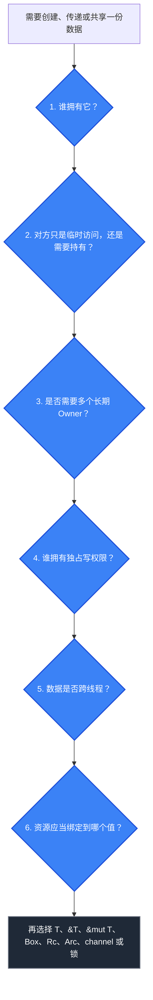

+++
title = 'Rust 心智模型：从 GC 语言转来后，写代码时应该怎样思考'
date = 2026-09-29T21:00:06+08:00
draft = false
description = '面向 GC 语言开发者，通过所有权、借用、共享、并发与 RAII 六个问题，建立编写 Rust 代码时的数据关系思维。'
image = 'cover.png'

categories = ['rust']
tags = ['rust', 'ownership', 'borrowing', 'memory-management', 'concurrency']
+++

2026 年，Rust 已经被越来越多的公司用于基础设施开发，我也从年初开始学习 Rust。

如果从 C 或 C++ 转向 Rust，可能更容易理解手动管理资源时需要考虑的问题。但我最早接触的是 Java 这类带 GC 的语言。刚开始写 Rust 时，我虽然了解所有权、借用和生命周期等语法，思考方式却仍然停留在 GC 语言上：需要一份数据就保存它的引用，遇到所有权问题就 `clone`，需要共享就套一层智能指针。

随着学习深入，我逐渐意识到：Rust 难学的不只是语法，而是它要求我们在写代码前先说清楚数据之间的关系。

本文整理了我从 GC 语言转向 Rust 后总结出的六个问题。它们不是 Rust 官方规定的标准流程，而是一套帮助我组织代码的心智模型。

> **阅读前提**：本文默认你已经了解所有权、move、借用和生命周期的基本含义。这里不会重新讲一遍语法，而是讨论什么时候应该想到这些机制。

## GC 语言与 Rust 的关注点有什么不同

在 Java、Go、C# 等带 GC 的语言中，我们通常先建立对象之间的引用关系，再由运行时判断对象何时可以回收。GC 减少了开发者显式管理内存生命周期的负担，也让我们不必在每次传递对象时都决定由谁负责释放内存。

Rust 采用了不同的取舍：程序需要表达数据的所有权和访问权限，编译器据此检查引用是否有效，并在 owner 离开作用域时调用 `drop`，释放它持有的资源。

| GC 背景下的常见直觉          | 写 Rust 时先问                       |
| ---------------------------- | ------------------------------------ |
| 先建立对象之间的引用关系     | 谁拥有这份数据？                     |
| 需要使用就保存引用           | 只是临时访问，还是需要长期持有？     |
| 多处保存同一个对象           | 是否真的需要多个长期 owner？         |
| 共享以后直接修改             | 谁拥有独占写权限？                   |
| 跨线程共享后再加锁           | 能否 move 或传消息？真的需要共享吗？ |
| 将清理交给运行时或额外控制流 | 资源应该绑定到哪个 owned value？     |

这里并不是说哪种方式绝对更好。GC 和所有权系统做出了不同的工程取舍。对刚接触 Rust 的我来说，真正需要改变的是：**不要先选择 `Arc`、`Mutex` 或 `clone`，而要先描述数据关系。**

## 写 Rust 前先问六个问题



这六个问题不是只能执行一次的线性流程。数据跨越函数、结构体或线程边界后，存活需求和访问方式可能改变，此时需要重新判断。

### 1. 谁拥有这份数据

Rust 中，每个值都有一个 owner。当 owner 离开作用域时，这个值会被 drop。对于非 `Copy` 类型，按值赋值或传参通常会转移所有权：

```rust
let s1 = String::from("hello");
let s2 = s1;

// println!("{s1}"); // error[E0382]: borrow of moved value
println!("{s2}");
```

`String` 的所有权已经从 `s1` move 到 `s2`。这里首先应该问的不是“怎样让编译器放过这段代码”，而是：后续到底应该由谁负责这份字符串？

常见的所有权表达包括：

- `T`：直接拥有一个值；
- move：将所有权交给另一个变量、函数或线程；
- `Copy`：复制一个值，原值仍然有效；
- `clone`：按照类型的 `Clone` 实现显式创建一个新值；
- `Box<T>`：在堆上存放 `T`，同时由 `Box` 独占拥有它。

`Box<T>` 改变的是值的存放和间接访问方式，不会自动产生多个 owner。`Clone` 只保证创建一个新值，底层数据是被复制还是继续共享，取决于类型的具体实现：`String::clone()` 通常会复制字符串数据，而 `Rc::clone()` 和 `Arc::clone()` 只会增加共享 owner。`clone` 也不是修复所有权错误的通用方法，应当先判断代码真正需要哪种所有权关系。

### 2. 对方只是 Borrow，还是需要 Own

拿到一份数据并不等于必须拥有它。调用者只是临时读取或修改时，借用通常比转移所有权更准确：

- `T`：获得所有权，并负责让值继续存活；
- `&T`：临时获得共享读取权限；
- `&mut T`：临时获得独占访问权限。

例如：

```rust
fn print_name(name: &str) {
    println!("{name}");
}

let name = String::from("Ferris");
print_name(&name);
println!("owner still has: {name}");
```

`print_name` 不需要保存字符串，也不负责它的生命周期，所以只接收借用。

生命周期标注也不会延长数据的存活时间。生命周期描述的是引用之间的有效性关系，帮助编译器确认引用被使用时，目标数据仍然有效。

### 3. 是否真的需要多个长期 Owner

GC 语言中的多个对象可以自然地保存对同一个对象的引用，但在 Rust 中，**共享访问不等于共享所有权**。

如果多个位置只是需要使用同一份数据，优先保留一个 owner，让其他位置借用。只有多个位置都必须独立持有，并共同保证数据继续存活时，才需要共享所有权：

- 单线程共享所有权：`Rc<T>`；
- 跨线程共享所有权：`Arc<T>`；
- 不拥有目标的反向关系：`Weak<T>`。

以树结构为例，如果父节点拥有子节点，而子节点只需要观察父节点，那么反向关系通常不应该也是强引用。使用 `Weak<T>` 可以表达“我能访问它，但不负责让它继续存活”，并避免强引用环导致内存无法释放。

需要注意的是，`Rc<T>` 和 `Arc<T>` 只解决“谁负责让数据存活”的问题，并不会自动允许修改内部数据。

### 4. 谁拥有独占写权限

Rust 借用规则要求同一时刻，对同一份数据只能处于以下互斥的两种状态之一：

- 存在多个不可变引用，用于共享读取；
- 存在一个可变引用，用于独占访问。

```rust
let mut value = 5;
let read = &value;

println!("{read}"); // read 的最后一次使用

let write = &mut value;
*write += 1;
```

`&mut T` 不只是“可以修改的引用”，还代表一段独占访问权限。如果共享读取仍在继续，就不能同时创建可变引用。

这条规则让编译器能够在类型层面防止数据竞争。`RefCell<T>`、`Mutex<T>` 等类型没有取消这条原则，而是将“独占修改”的检查转移到运行时或同步机制中：

- `RefCell<T>` 在单线程中运行时检查借用规则；
- `Mutex<T>` 通过加锁协调线程间的独占访问；
- `RwLock<T>` 允许多个读者或一个写者。

因此，不应该只是为了绕过借用检查就立即引入内部可变性。先判断数据关系是否能调整，确实需要共享后修改时，再选择相应工具。

### 5. 数据是否需要跨线程

跨线程时，我以前容易直接想到 `Arc<Mutex<T>>`。但更合适的第一个问题是：**数据的所有权应该怎样在线程之间流动？**

通常可以按这个顺序考虑：

1. 工作线程能否直接取得数据的所有权？
2. 能否通过 channel 传递数据或结果？
3. 是否真的需要多个线程长期访问同一份状态？
4. 只有确实需要共享时，再考虑 `Arc`、锁或原子类型。

Rust 用两个 marker trait 表达类型的跨线程能力：

| Marker auto trait | 表达的能力                           |
| ----------------- | ------------------------------------ |
| `Send`            | 值的所有权可以安全地转移到另一个线程     |
| `Sync`            | 对 `T` 的共享引用可以安全地跨线程使用    |

更精确地说，`T: Sync` 等价于 `&T: Send`。`Arc<T>` 只解决跨线程共享所有权的问题，不会自动让内部的 `T` 变成线程安全；能否安全地在线程间转移或共享，仍然取决于 `T` 的 `Send` / `Sync` 约束。

它们是类型契约，不是完整的并发正确性证明。Safe Rust 可以防止数据竞争和无效引用，但不能自动防止 deadlock、starvation 或业务逻辑上的 race condition。

### 6. 资源应该绑定到哪个值

所有权管理的不只是堆内存。文件、网络连接和锁等资源也可以由具体的 value 或 guard 持有，并在这个值被 drop 时释放。

```rust
let mut guard = state.lock().unwrap();
guard.push(item);
// guard 离开作用域后，锁被释放
```

这种方式通常被称为 RAII：资源的生命周期与拥有它的值绑定。写代码时仍然需要继续追问：这个资源或权限应该持有多久？

如果锁的 guard 覆盖了慢速 I/O：

```rust
let mut guard = state.lock().unwrap();
guard.push(item);
slow_io(); // 此时 guard 仍然存活，锁尚未释放
```

代码没有发生 data race，却可能降低并发吞吐量，甚至参与形成死锁。可以使用更小的作用域限制 guard：

```rust
{
    let mut guard = state.lock().unwrap();
    guard.push(item);
} // 在慢速操作前释放锁

slow_io();
```

所以，“值何时 drop”既是内存问题，也是资源和权限管理问题。

## 案例一：用函数参数表达单线程数据关系

假设我们正在编写一个小型任务处理服务。它包含运行期间只读的配置、一次性任务和处理统计：

```rust
struct Config {
    endpoint: String,
}

struct Task {
    id: u64,
    payload: String,
}

#[derive(Default)]
struct Stats {
    completed: usize,
    failed: usize,
}

fn process_task(config: &Config, task: Task, stats: &mut Stats) {
    println!("send task {} to {}", task.id, config.endpoint);

    if task.payload.is_empty() {
        stats.failed += 1;
    } else {
        stats.completed += 1;
    }
}
```

三个参数分别表达了不同的数据关系：

- `&Config`：处理函数只临时读取配置，不负责让配置继续存活；
- `Task`：任务会被处理方消费，因此将所有权 move 给函数；
- `&mut Stats`：处理期间，函数暂时取得统计数据的独占修改权限。

这里没有为了避免 move 而 clone `Task`，也没有为了共享配置而立即使用 `Rc`。先明确业务中的 owner 和访问方式，函数签名就可以直接表达这些关系。

“谁拥有”还可以分成两个层次：业务上哪个组件决定数据需要存活多久，以及代码中哪个值实际持有数据。例如，服务在业务上负责配置的整个运行期，代码中则可以由 `App` 结构体直接拥有 `Config`。

## 案例二：跨线程时优先让所有权流动

如果任务生产者和 worker 独立运行，可以通过 channel 移交任务：

```rust
let (tx, rx) = std::sync::mpsc::channel::<Task>();

let worker = std::thread::spawn(move || {
    while let Ok(task) = rx.recv() {
        println!("received task {}", task.id);
    }
});

let task = Task {
    id: 1,
    payload: "hello".to_owned(),
};

// send 会转移 task 的所有权，发送方之后不能再使用它
tx.send(task).expect("worker disconnected");
drop(tx);
worker.join().expect("worker panicked");
```

这里使用 channel 不是因为它一定比锁更好，而是任务天然适合从生产者流向消费者，ownership 的移动方向与业务流程一致。

如果多个长期运行的 worker 必须读取同一份配置，可以使用 `Arc<Config>`。如果它们还必须修改同一份复杂状态，才进一步考虑 `Arc<Mutex<Stats>>`：

```rust
let stats = std::sync::Arc::new(std::sync::Mutex::new(Stats::default()));
let worker_stats = std::sync::Arc::clone(&stats);

let worker = std::thread::spawn(move || {
    {
        let mut guard = worker_stats.lock().expect("stats mutex poisoned");
        guard.completed += 1;
    } // MutexGuard 被 drop，锁在这里释放

    slow_io();
});

worker.join().expect("worker panicked");
```

这里的三个类型分别承担不同职责：

- `Arc`：让多个 owner 共同保证 `Stats` 存活；
- `Mutex`：协调对内部数据的独占访问；
- `MutexGuard`：代表已经获得的锁权限，其生命周期决定锁持有多久。

如果状态只是一个简单计数器，可以考虑 atomic；如果可以让一个 owner 汇总结果，也可以继续使用 channel。`Arc<Mutex<T>>` 是特定数据关系的表达，而不是跨线程代码的默认模板。

## 五道心智模型练习

下面这些代码都很短。与其只记住修复方式，不如先回答每道题背后的数据关系。

### 1. move 以后，谁负责字符串

```rust
let s1 = String::from("hello");
let s2 = s1;
println!("{s1}");
```

- **错误直觉**：`s2 = s1` 只是复制了一个指向同一对象的引用。
- **重新追问**：最终需要一个 owner，还是两个独立值？
- **心智模型**：`String` 不是 `Copy` 类型，ownership 已从 `s1` move 到 `s2`。
- **处理方式**：根据需要表达两种不同关系：

  ```rust
  // 只需要临时访问
  let s1 = String::from("hello");
  let s2 = &s1;
  println!("{s1}, {s2}");

  // 确实需要两个独立的 String
  let s1 = String::from("hello");
  let s2 = s1.clone();
  println!("{s1}, {s2}");
  ```

### 2. 共享读取为什么与独占修改冲突

```rust
let mut value = 5;
let read = &value;
let write = &mut value;
println!("{read}, {write}");
```

- **错误直觉**：同一线程不会产生 data race，所以读写引用可以任意重叠。
- **重新追问**：共享读取的最后一次使用在哪里？修改期间能否保证独占访问？
- **心智模型**：`read` 后续仍被使用，因此共享借用与 `write` 的独占借用重叠。
- **处理方式**：先结束读取，再创建 `&mut value`；不要为了缩短借用而立即引入 `RefCell`。

### 3. 父子节点都应该持有强引用吗

假设树节点需要从父节点访问子节点，同时允许从子节点查看父节点：

- **错误直觉**：让父子互相持有，就能保证双方都不会提前消失。
- **重新追问**：哪条关系表示拥有，哪条关系只是观察？
- **心智模型**：在“父拥有子、子只观察父”的模型里，反向关系通常不应该拥有目标。
- **处理方式**：确实存在多个长期 owner 时使用 `Rc`；反向观察关系使用 `Weak`，避免强引用环。某些场景也可以使用 arena 或稳定 ID 管理节点。

### 4. `Rc<RefCell<T>>` 能直接发送到其他线程吗

```rust
use std::cell::RefCell;
use std::rc::Rc;

let counter = Rc::new(RefCell::new(0));
std::thread::spawn(move || {
    *counter.borrow_mut() += 1;
});
```

- **错误直觉**：引用计数和运行时借用检查已经足以保证并发安全。
- **重新追问**：工作线程能否独占数据？是否真的需要多线程共享修改？
- **心智模型**：`Rc` 和 `RefCell` 不提供跨线程需要的同步保证，也不满足相应的 `Send` / `Sync` 约束。
- **处理方式**：能独占就直接 move；能传递数据就使用 channel。确实需要跨线程共享时，简单计数可以使用 `Arc<AtomicUsize>`，复杂共享状态可以使用 `Arc<Mutex<T>>` 或 `Arc<RwLock<T>>`。其中 `Arc` 负责共享 ownership，`Mutex`、`RwLock` 或 atomic 负责并发访问或同步。

### 5. RAII guard 应该持有多久

```rust
let mut guard = state.lock().unwrap();
guard.push(item);
slow_io();
```

- **错误直觉**：只要使用了 `Mutex`，锁持有多久都只是实现细节。
- **重新追问**：这份资源权限真正需要覆盖的最小代码区间是什么？
- **心智模型**：`MutexGuard` 拥有锁权限，通常在它被 drop 时释放锁。
- **处理方式**：用更小的 block 限制 guard 的作用域，或者在逻辑清晰时显式调用 `drop(guard)`，再执行耗时操作。

## 总结

从 GC 语言转向 Rust，重要的不是把所有引用替换成智能指针，而是要考虑 Rust 特有的 Ownership 和 Borrowing 机制。

具体来说，就是先把数据关系说清楚：

1. 谁拥有这份数据？
2. 对方只是临时访问，还是需要持有？
3. 是否真的需要多个长期 owner？
4. 谁拥有独占写权限？
5. 数据是否需要跨线程？
6. 资源应该绑定到哪个值，又应该持有多久？

当这些问题有了答案，`T`、`&T`、`&mut T`、`Box`、`Rc`、`Weak`、`Arc`、channel 和锁就不再是一组需要猜测的工具，而是数据关系在代码中的表达。

这也是我现阶段理解 Rust 的方式：编译器报错并不只是要求我修改语法，它往往是在提醒我，还有某段所有权或访问关系没有想清楚。

## 参考资料

- [The genius of Rust’s memory model](https://www.youtube.com/watch?v=XGtWsfnnvh0)
