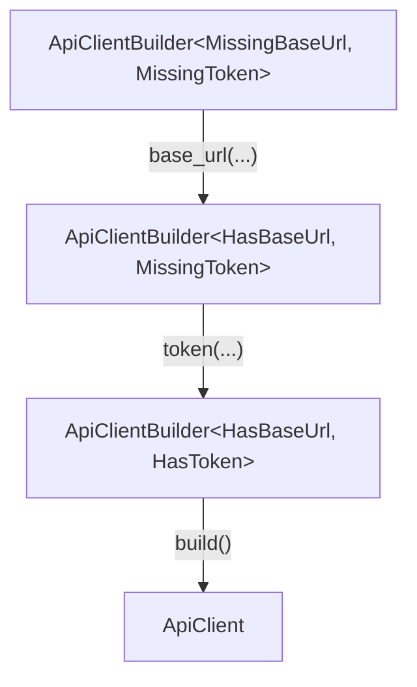
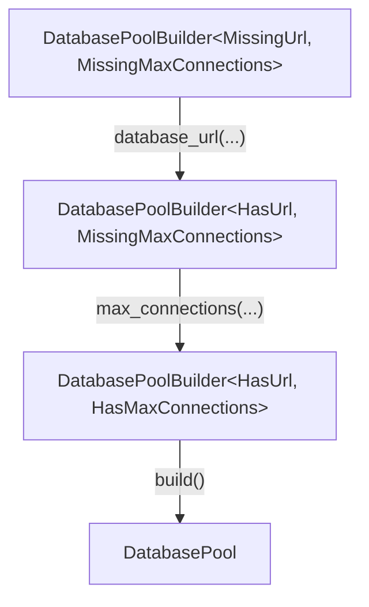

+++
title = 'Rust Typestate Builder：让配置错误在编译期暴露'
date = 2026-08-05T00:00:00+08:00
draft = false
description = '用 Rust Typestate Builder 表达构造阶段，把必填配置和构建顺序变成类型约束。'
categories = ['rust']
tags = ['rust', 'type-system', 'design-pattern', 'builder-pattern']
+++

## 背景：普通 Builder 解决了什么，又留下了什么

Builder Pattern 很适合处理配置项较多的对象。

比如一个后端服务里的 API Client，通常需要：

- `base_url`：服务地址，必填。
- `token`：认证令牌，必填。
- `timeout_secs`：请求超时时间，可选。

普通 Builder 可以让调用代码更清楚：

```rust
let client = ApiClientBuilder::new()
    .base_url("https://api.example.com")
    .token("secret")
    .timeout_secs(10)
    .build()?;
```

问题是：**普通 Builder 很难在编译期区分必填项是否已经设置**。

常见做法是在 `build()` 里做运行时检查：

```rust
struct ApiClientBuilder {
    base_url: Option<String>,
    token: Option<String>,
    timeout_secs: u64,
}

impl ApiClientBuilder {
    fn build(self) -> Result<ApiClient, &'static str> {
        let base_url = self.base_url.ok_or("missing base_url")?;
        let token = self.token.ok_or("missing token")?;

        Ok(ApiClient {
            base_url,
            token,
            timeout_secs: self.timeout_secs,
        })
    }
}
```

这当然能用，也经常够用。但调用者仍然可以写出这种代码：

```rust
let client = ApiClientBuilder::new()
    .token("secret")
    .build()?;
```

编译器不会拦住它。只有程序运行到 `build()`，才会发现 `base_url` 没有配置。

如果这些配置只是内部代码里的一次性结构，运行时校验没什么问题。但如果这是一个公开 API，或者漏配会导致启动失败、认证失败、连接失败，Typestate Builder 就值得考虑。

## Typestate Builder 是什么

Typestate Builder 是 Typestate Pattern 在 Builder 场景下的应用。

它的核心思想是：**用类型表示构建状态**。

普通 Builder 把“字段是否设置”放在运行时的 `Option` 里；Typestate Builder 把“字段是否设置”放进类型参数里，可以让类型系统在编译时就检查出配置错误。



在这个设计里，`build()` 只定义在完整状态上：

```text
ApiClientBuilder<HasBaseUrl, HasToken>
```

如果调用者没有设置 `base_url` 或 `token`，当前 Builder 的类型就不是完整状态，自然也没有 `build()` 方法。

这不是让运行时报错更早，而是让错误代码根本无法编译。

## 和第一篇 Typestate 的区别

如果还不熟悉 Typestate Pattern 本身，可以先看上一篇：[Rust Typestate Pattern：用类型系统约束状态流转]()。

上一篇文章里的 Typestate 重点是对象运行过程中的状态：

```text
ApiClient<Unauthenticated>
        |
        | login(self)
        v
ApiClient<Authenticated>
```

Typestate Builder 关注的是对象构造过程中的状态：

```text
Builder<MissingBaseUrl, MissingToken>
        |
        | base_url(...)
        v
Builder<HasBaseUrl, MissingToken>
        |
        | token(...)
        v
Builder<HasBaseUrl, HasToken>
        |
        | build()
        v
ApiClient
```

两者底层思路一样：用类型表达状态，不同状态暴露不同方法。

区别在于：

| 模式              | 状态含义         | 典型场景                         |
| ----------------- | ---------------- | -------------------------------- |
| Typestate         | 对象当前能做什么 | 连接、认证、事务、资源生命周期   |
| Typestate Builder | 对象是否构造完整 | 必填配置、构建顺序、协议配置阶段 |

所以这篇不再重复所有 Typestate 基础，只关注 Builder 场景里最常见的写法。

## 示例：ApiClientBuilder

先定义最终要构造的对象：

```rust
struct ApiClient {
    base_url: String,
    token: String,
    timeout_secs: u64,
}
```

然后定义四个状态标记：

```rust
struct MissingBaseUrl;
struct HasBaseUrl;
struct MissingToken;
struct HasToken;
```

这些类型不保存数据，只给编译器看。

Builder 本体用两个类型参数分别表示两个必填项是否已经设置：

```rust
use std::marker::PhantomData;

struct ApiClientBuilder<BaseUrlState, TokenState> {
    base_url: Option<String>,
    token: Option<String>,
    timeout_secs: u64,
    _state: PhantomData<(BaseUrlState, TokenState)>,
}
```

这里仍然使用 `Option<String>` 保存字段值，因为构造过程中字段确实可能还不存在。不同的是：是否允许调用 `build()`，不再依赖运行时检查，而是由类型状态决定。

### 初始状态

`new()` 返回两个必填项都缺失的 Builder：

```rust
impl ApiClientBuilder<MissingBaseUrl, MissingToken> {
    fn new() -> Self {
        Self {
            base_url: None,
            token: None,
            timeout_secs: 30,
            _state: PhantomData,
        }
    }
}
```

### 设置 base_url

`base_url()` 会消费旧 Builder，返回 `HasBaseUrl` 状态的新 Builder：

```rust
impl<TokenState> ApiClientBuilder<MissingBaseUrl, TokenState> {
    fn base_url(self, base_url: impl Into<String>) -> ApiClientBuilder<HasBaseUrl, TokenState> {
        ApiClientBuilder {
            base_url: Some(base_url.into()),
            token: self.token,
            timeout_secs: self.timeout_secs,
            _state: PhantomData,
        }
    }
}
```

注意这里的 `TokenState` 是泛型。它表示：无论 token 当前是否已经设置，只要 base_url 还没设置，就允许调用 `base_url()`。

### 设置 token

`token()` 的写法类似：

```rust
impl<BaseUrlState> ApiClientBuilder<BaseUrlState, MissingToken> {
    fn token(self, token: impl Into<String>) -> ApiClientBuilder<BaseUrlState, HasToken> {
        ApiClientBuilder {
            base_url: self.base_url,
            token: Some(token.into()),
            timeout_secs: self.timeout_secs,
            _state: PhantomData,
        }
    }
}
```

这让调用顺序保持灵活。下面两种都可以：

```rust
ApiClientBuilder::new()
    .base_url("https://api.example.com")
    .token("secret");

ApiClientBuilder::new()
    .token("secret")
    .base_url("https://api.example.com");
```

Typestate Builder 约束的是“最终必须设置”，不是强迫调用者按唯一顺序配置。

### 设置可选项

可选项不参与状态流转，直接保留当前状态即可：

```rust
impl<BaseUrlState, TokenState> ApiClientBuilder<BaseUrlState, TokenState> {
    fn timeout_secs(mut self, timeout_secs: u64) -> Self {
        self.timeout_secs = timeout_secs;
        self
    }
}
```

### 只有完整状态才能 build

最后，把 `build()` 只定义在完整状态上：

```rust
impl ApiClientBuilder<HasBaseUrl, HasToken> {
    fn build(self) -> ApiClient {
        ApiClient {
            base_url: self.base_url.expect("base_url checked by typestate"),
            token: self.token.expect("token checked by typestate"),
            timeout_secs: self.timeout_secs,
        }
    }
}
```

这里仍然有 `expect()`，但它不再承担业务校验职责。因为只要代码能调用到这个 `build()`，类型系统已经保证两个字段都设置过。

完整使用方式如下：

```rust
fn main() {
    let client = ApiClientBuilder::new()
        .base_url("https://api.example.com")
        .token("secret")
        .timeout_secs(10)
        .build();

    println!("{} {}", client.base_url, client.timeout_secs);
}
```

如果漏掉 `base_url`：

```rust
let client = ApiClientBuilder::new()
    .token("secret")
    .build();
```

这段代码无法通过编译。因为当前类型是：

```text
ApiClientBuilder<MissingBaseUrl, HasToken>
```

它没有 `build()` 方法。

## 真实世界案例：rustls ConfigBuilder

后端开发里比较典型的真实案例是 `rustls::ConfigBuilder`。

`rustls` 的配置不是简单地把几个字段塞进结构体。TLS 配置有明确阶段：协议版本、证书校验、客户端或服务端身份配置等。如果配置顺序或完整性出错，影响的不是代码风格，而是连接安全性和运行时行为。

`rustls` 的 `ConfigBuilder` 类型大致长这样：

```rust
ConfigBuilder<Side, State>
```

其中：

- `Side` 表示正在构建 client config 还是 server config。
- `State` 表示当前配置阶段。

这和本文的 `ApiClientBuilder<BaseUrlState, TokenState>` 是同一类思路：把“构建到了哪一步”放进类型参数，让不完整的配置链无法直接构造最终对象。

当然，`rustls` 的真实实现比本文示例复杂得多，因为它要覆盖 TLS 的真实配置边界。我们不需要一上来照抄它的复杂度。先理解这个小模型，再看大型库的 Typestate Builder 会轻松很多。

## 什么时候适合用 Typestate Builder

Typestate Builder 最适合这些场景：

- 必填项数量少，但很重要。
- 构造顺序或构造阶段有明确规则。
- API 会暴露给其他模块或外部用户。
- 配置错误最好在编译期暴露，而不是启动后失败。
- 错误配置可能影响安全、连接、数据一致性或协议正确性。

后端开发里可以考虑这些对象：

- `HttpClientBuilder`
- `DatabasePoolBuilder`
- `MessageProducerBuilder`
- `TlsConfigBuilder`
- `ServiceConfigBuilder`

但它不适合所有 Builder。

如果只是一个内部配置结构，字段很多、规则简单，而且 `build()` 返回 `Result` 已经足够清楚，那普通 Builder 更直接。

一个实用判断是：**如果 Typestate Builder 让调用者少犯错，它是设计；如果只是让实现者多写泛型，它是负担。**

## 练习：实现 DatabasePoolBuilder

实现一个简化版数据库连接池 Builder。



要求：

- 最终类型是 `DatabasePool`。
- 必填项：`database_url`。
- 必填项：`max_connections`。
- 可选项：`connect_timeout_secs`，默认值为 `30`。
- 只有两个必填项都设置后，才能调用 `build()`。
- 不需要真的连接数据库。

目标调用方式：

```rust
let pool = DatabasePoolBuilder::new()
    .database_url("postgres://localhost/app")
    .max_connections(16)
    .connect_timeout_secs(5)
    .build();
```

下面这种代码应该无法通过编译：

```rust
let pool = DatabasePoolBuilder::new()
    .database_url("postgres://localhost/app")
    .build();
```

<details>
<summary>参考答案</summary>

```rust
use std::marker::PhantomData;

struct MissingUrl;
struct HasUrl;
struct MissingMaxConnections;
struct HasMaxConnections;

struct DatabasePool {
    database_url: String,
    max_connections: u32,
    connect_timeout_secs: u64,
}

struct DatabasePoolBuilder<UrlState, MaxConnectionsState> {
    database_url: Option<String>,
    max_connections: Option<u32>,
    connect_timeout_secs: u64,
    _state: PhantomData<(UrlState, MaxConnectionsState)>,
}

impl DatabasePoolBuilder<MissingUrl, MissingMaxConnections> {
    fn new() -> Self {
        Self {
            database_url: None,
            max_connections: None,
            connect_timeout_secs: 30,
            _state: PhantomData,
        }
    }
}

impl<MaxConnectionsState> DatabasePoolBuilder<MissingUrl, MaxConnectionsState> {
    fn database_url(
        self,
        database_url: impl Into<String>,
    ) -> DatabasePoolBuilder<HasUrl, MaxConnectionsState> {
        DatabasePoolBuilder {
            database_url: Some(database_url.into()),
            max_connections: self.max_connections,
            connect_timeout_secs: self.connect_timeout_secs,
            _state: PhantomData,
        }
    }
}

impl<UrlState> DatabasePoolBuilder<UrlState, MissingMaxConnections> {
    fn max_connections(self, max_connections: u32) -> DatabasePoolBuilder<UrlState, HasMaxConnections> {
        DatabasePoolBuilder {
            database_url: self.database_url,
            max_connections: Some(max_connections),
            connect_timeout_secs: self.connect_timeout_secs,
            _state: PhantomData,
        }
    }
}

impl<UrlState, MaxConnectionsState> DatabasePoolBuilder<UrlState, MaxConnectionsState> {
    fn connect_timeout_secs(mut self, connect_timeout_secs: u64) -> Self {
        self.connect_timeout_secs = connect_timeout_secs;
        self
    }
}

impl DatabasePoolBuilder<HasUrl, HasMaxConnections> {
    fn build(self) -> DatabasePool {
        DatabasePool {
            database_url: self.database_url.expect("database_url checked by typestate"),
            max_connections: self.max_connections.expect("max_connections checked by typestate"),
            connect_timeout_secs: self.connect_timeout_secs,
        }
    }
}

fn main() {
    let pool = DatabasePoolBuilder::new()
        .database_url("postgres://localhost/app")
        .max_connections(16)
        .connect_timeout_secs(5)
        .build();

    println!(
        "{} {} {}",
        pool.database_url, pool.max_connections, pool.connect_timeout_secs
    );
}
```

</details>

## 总结

Typestate Builder 的价值不是“让 Builder 看起来更高级”，而是把关键构造规则放进类型系统。

普通 Builder 适合大多数配置对象。Typestate Builder 更适合那些必填项少、规则重要、错误代价高的公开 API。

在 Rust 中实现它通常需要：

- 用空类型表示配置状态。
- 用泛型参数把状态挂到 Builder 上。
- 设置必填项时消费旧 Builder，返回新状态 Builder。
- 只在完整状态上暴露 `build()`。
- 可选项不改变状态，直接返回 `Self`。

先用普通 Builder，发现 `build()` 里的校验代表的是公开 API 约束，再考虑升级成 Typestate Builder。这样它会是一种清晰的 API 设计，而不是类型系统表演。

## References

- [rustls ConfigBuilder documentation](https://docs.rs/rustls/latest/rustls/struct.ConfigBuilder.html)
- [Rust standard library: PhantomData](https://doc.rust-lang.org/std/marker/struct.PhantomData.html)
- [The Embedded Rust Book: Typestate Programming](https://docs.rust-embedded.org/book/static-guarantees/typestate-programming.html)
