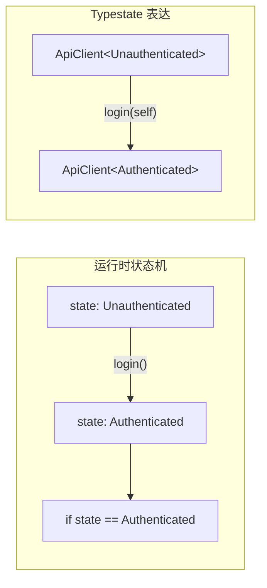
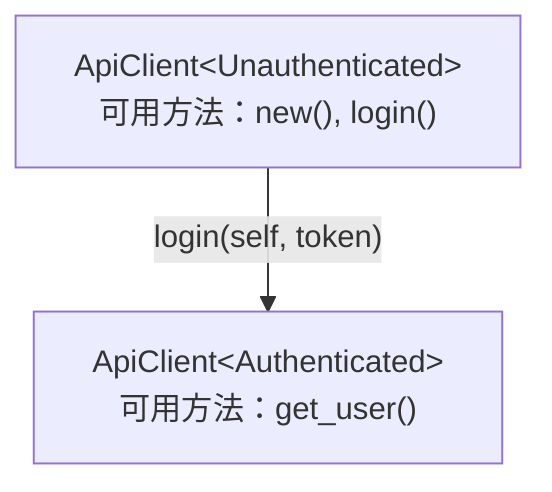

+++
title = 'Rust Typestate Pattern：用类型系统约束状态流转'
date = 2026-08-04T00:00:00+08:00
lastmod = 2026-08-13T18:55:23+08:00
draft = false
description = '用 Rust 类型系统表达对象状态，把错误的调用顺序提前到编译期发现。'
image = 'cover.png'
categories = ['rust']
tags = ['rust', 'type-system', 'design-pattern']
+++

## 更新记录

- 2026-08-13：练习由 Database Connection 替换为自动售货机（Idle → CoinInserted → Dispensing，含 `timeout()` 显式转移），与「Typestate 的边界」一节的正面例子呼应。
- 2026-08-12：新增「Typestate 的边界：它保证调用顺序，不保证现实」一节，区分非法调用顺序与运行时失败，补充售货机等外部失效可建模成显式转移的正面例子。

## 背景：运行时状态检查的问题

很多对象都有状态。

比如一个后端服务里的 API Client，刚创建时还没有登录，登录后才能请求需要认证的接口。最直接的写法通常是在结构体里放一个字段：

```rust
struct ApiClient {
    base_url: String,
    token: Option<String>,
}
```

然后在每个需要认证的方法里检查：

```rust
impl ApiClient {
    fn get_user(&self, id: u64) -> Result<String, &'static str> {
        if self.token.is_none() {
            return Err("not authenticated");
        }

        Ok(format!("GET /users/{id}"))
    }
}
```

这种写法很常见，也不一定错。但它有一个问题：**错误的调用顺序只能在运行时发现**。

调用者可以写出这样的代码：

```rust
let client = ApiClient {
    base_url: "https://api.example.com".to_string(),
    token: None,
};

client.get_user(1)?;
```

编译器不会阻止它。只有运行到 `get_user()` 时，代码才会发现这个 client 还没有认证。

Typestate Pattern 解决的就是这类问题：如果一个对象在不同状态下拥有不同能力，就把状态放进类型里，让错误调用顺序在编译期失败。

## Typestate Pattern 是什么

Typestate Pattern 是一种**用类型系统表达对象状态**的设计模式。

它的核心思想很简单：

| 思路                 | 含义                               |
| -------------------- | ---------------------------------- |
| 用类型表示状态       | 不同状态对应不同类型               |
| 不同状态暴露不同方法 | 当前状态不能做的事，API 上就不存在 |
| 状态转换返回新类型   | 从一个状态进入另一个状态           |

可以把它理解成：把运行时状态机搬到编译期类型系统里。



换成代码里的类型，大概就是：

```text
ApiClient<Unauthenticated>
      |
      | login(self)
      v
ApiClient<Authenticated>
```

这里用泛型是为了将 API 本身变成了约束。未认证的 client 没有 `get_user()` 方法，调用者自然写不出非法调用。

## Typestate 和 enum 状态机的区别

`enum` 也能表达状态。比如：

```rust
enum ClientState {
    Unauthenticated,
    Authenticated,
}
```

区别在于：`enum` 的状态是一个运行时值，Typestate 的状态是类型。

| 维度     | enum 状态机           | Typestate         |
| -------- | --------------------- | ----------------- |
| 状态表示 | value                 | type              |
| 检查时间 | 运行时                | 编译期            |
| 状态切换 | 修改字段或 enum value | 返回新类型        |
| 非法状态 | 需要方法内部判断      | 公开 API 无法表达 |
| 灵活性   | 更高                  | 更低              |
| 适合场景 | 动态状态很多          | 固定流程清楚      |

所以 Typestate 不是 `enum` 的替代品。它更适合固定流程，例如连接、认证、握手、资源打开关闭、构建器必填步骤等。

如果状态经常在运行时动态变化，或者状态组合很多，普通 `enum` 往往更简单。

## 为什么 Rust 很适合实现 Typestate

Rust 适合 Typestate，主要靠四个语言特性。

| Rust 特性       | 在 Typestate 中的作用              |
| --------------- | ---------------------------------- |
| ownership       | 状态转换可以消费旧对象             |
| generics        | 把状态作为类型参数挂到对象上       |
| Zero Sized Type | 用空类型表示状态，不保存运行时数据 |
| PhantomData     | 表达结构体逻辑上关联某个状态类型   |

其中最核心的就是 Rust 有“**移动语义（`move`）**”。和 C++ 这类同样支持移动语义的语言相比，Rust 会在 move 后禁止继续使用旧值。状态转换方法可以消费旧对象，让调用者只能继续使用转换后的新状态。

先定义几个状态类型：

```rust
struct Unauthenticated;
struct Authenticated;
```

这种空结构体不保存数据，只是编译期标记。它们通常是 Zero Sized Type。

然后把状态挂到主类型上：

```rust
use std::marker::PhantomData;

struct ApiClient<State> {
    base_url: String,
    token: Option<String>,
    _state: PhantomData<State>,
}
```

`PhantomData<State>` 的意思是：`ApiClient` 逻辑上携带一个 `State` 类型，但运行时不真的存储一个 `State` 值。

这里不需要展开 `PhantomData` 的高级语义。对 Typestate 来说，先记住一句话就够了：**它把状态类型和对象关联起来，用作编译期标记**。

## 示例：API Client 认证状态

> ❗你不用花太多时间了解下面的案例代码，因为后面章节会具体讲解如何在 Rust 中使用 Typestate

现在先看一个案例：把 API Client 改成 Typestate。



先定义两个状态：

```rust
use std::marker::PhantomData;

struct Unauthenticated;
struct Authenticated;

struct ApiClient<State> {
    base_url: String,
    token: Option<String>,
    _state: PhantomData<State>,
}
```

未认证状态只提供 `new()` 和 `login()`：

```rust
impl ApiClient<Unauthenticated> {
    fn new(base_url: impl Into<String>) -> Self {
        Self {
            base_url: base_url.into(),
            token: None,
            _state: PhantomData,
        }
    }

    fn login(self, token: impl Into<String>) -> Result<ApiClient<Authenticated>, &'static str> {
        let token = token.into();

        if token.is_empty() {
            return Err("empty token");
        }

        Ok(ApiClient {
            base_url: self.base_url,
            token: Some(token),
            _state: PhantomData,
        })
    }
}
```

认证状态才提供需要登录后的能力：

```rust
impl ApiClient<Authenticated> {
    fn get_user(&self, id: u64) -> String {
        format!("GET {}/users/{id}", self.base_url)
    }
}
```

使用时，调用顺序被类型系统约束住：

```rust
fn main() -> Result<(), &'static str> {
    let client = ApiClient::<Unauthenticated>::new("https://api.example.com")
        .login("token")?;

    println!("{}", client.get_user(1));

    Ok(())
}
```

如果还没登录就调用 `get_user()`：

```rust
let client = ApiClient::<Unauthenticated>::new("https://api.example.com");

client.get_user(1);
```

这段代码不会通过编译。因为 `get_user()` 只定义在 `ApiClient<Authenticated>` 上。

这就是 Typestate 最核心的价值：**把“调用前必须处于某个状态”变成类型签名的一部分**。

## Rust Typestate 的实现步骤

实现 Typestate 时，可以按这个顺序来：

```text
识别真实状态
    ↓
用空类型表示状态
    ↓
用泛型把状态绑定到对象
    ↓
为不同状态实现不同方法
    ↓
消费 self 返回新状态
```

### 1. 识别真实状态

先问三个问题：

- 对象是否存在明确阶段？
- 不同阶段是否允许不同操作？
- 错误调用顺序是否值得提前到编译期发现？

如果答案都是“是”，Typestate 才值得考虑。

### 2. 用空类型表示状态

```rust
struct Unauthenticated;
struct Authenticated;
```

状态类型只负责表达状态，不负责保存数据。

### 3. 用泛型绑定状态

```rust
struct ApiClient<State> {
    base_url: String,
    token: Option<String>,
    // 用 PhantomData 关联类型，表示这个 State 泛型参数可以传入不同的空 struct
    _state: PhantomData<State>,
}
```

`ApiClient<Unauthenticated>` 和 `ApiClient<Authenticated>` 是两个不同类型。

### 为什么要使用 PhantomData

`PhantomData<T>` 是 Rust 标准库提供的**零大小类型（Zero Sized Type，ZST）**。本质就是一种**类型标记**，给编译器看的东西。

问题：如果状态类型只存在于泛型参数中：

```rust
struct EmailDraft<State> {
}
```

Rust 会认为 `State` 没有被使用：

```text
type parameter `State` is never used
```

### 4. 为不同状态定义不同能力

```rust
impl ApiClient<Unauthenticated> {
    fn login(self, token: impl Into<String>) -> Result<ApiClient<Authenticated>, &'static str> {
        // ...
    }
}

impl ApiClient<Authenticated> {
    fn get_user(&self, id: u64) -> String {
        // ...
    }
}
```

方法定义在哪个状态上，哪个状态才拥有这个能力。

### 5. 消费 self 完成状态转换

状态转换方法通常接收 `self`，而不是 `&self`：

```rust
fn login(self, token: impl Into<String>) -> Result<ApiClient<Authenticated>, &'static str>
```

这样旧状态会被移动掉。登录成功后，调用者拿到的是新的 `ApiClient<Authenticated>`，原来的 `ApiClient<Unauthenticated>` 不会继续存在。

## 真实世界案例

### Embedded Rust GPIO

Embedded Rust 里经常用 Typestate 表达硬件引脚状态。例如 GPIO pin 可以处于输入模式或输出模式：

```rust
Pin<Input>
Pin<Output>
```

只有 `Pin<Output>` 才应该能设置高低电平，`Pin<Input>` 不应该有 `set_high()` 这类方法。

这个例子离后端开发稍远，但它非常直观：同一个物理引脚，在不同模式下拥有不同能力。Typestate 正好适合把这种能力差异放进类型系统。

### rustls ConfigBuilder

后端开发更可能接触到的例子是 TLS 配置。`rustls` 的 `ConfigBuilder` 使用了类似 Typestate Builder 的设计：

```rust
ConfigBuilder<Side, State>
```

其中 `Side` 表示客户端配置还是服务端配置，`State` 表示当前构建器还处在哪个配置阶段。

TLS 配置天然有一些“必须先完成”的步骤，比如协议版本、证书校验、证书配置等。把这些阶段编码到类型里，可以让一部分错误配置链在编译期暴露。

这属于 Typestate Pattern 在 Builder 场景下的应用。本文先点到为止，Builder 场景下的展开可以继续看：[Rust Typestate Builder：让配置错误在编译期暴露]()。

## 什么时候不要用 Typestate

Typestate 很有用，但也很容易被滥用成类型体操。

下面这些场景通常不值得用：

- 状态组合太多，比如 6 个独立配置项都变成类型状态，组合会膨胀到 64 种。
- 流程只在一个模块内部短暂存在，普通函数拆分就能保证顺序。
- 状态主要由运行时输入决定，`enum` 更自然。
- 普通 Builder 在 `build()` 做一次校验已经足够清楚。

一个简单判断是：**Typestate 更适合作为公开 API 的约束，而不是内部实现里的炫技**。

如果它能让调用者更难写错，值得考虑。如果只是让实现者写出更多泛型，先停一下。

## 练习：实现一个状态安全的自动售货机

实现一个简化版自动售货机，要求（练习只关注调用顺序约束，所以方法都返回具体状态类型；真实场景里 `select()` 会因商品售罄、`dispense()` 会因找零失败返回 `Result`，见下一节）：

- `VendingMachine::new()` 创建 `VendingMachine<Idle>`。
- 只有 `VendingMachine<Idle>` 能调用 `insert_coin(amount)`。
- 只有 `VendingMachine<CoinInserted>` 能调用 `select(item)` 或 `timeout()`。
- 只有 `VendingMachine<Dispensing>` 能调用 `dispense()`。
- `dispense()` 返回 `VendingMachine<Idle>`，等待下一次交易。
- 用 `println!` 模拟出货即可，不需要真实的库存或找零逻辑。

目标调用方式：

```rust
fn main() {
    // 正常流程：投币 → 选择 → 出货
    VendingMachine::<Idle>::new()
        .insert_coin(5)
        .select("coke")
        .dispense();

    // 超时是显式转移：不选择则退款回到 Idle，可以重新开始
    VendingMachine::<Idle>::new()
        .insert_coin(5)
        .timeout()
        .insert_coin(3)
        .select("water")
        .dispense();
}
```

下面这些调用应该无法通过编译：

```rust
// 没投币就选商品：select() 只存在于 CoinInserted
VendingMachine::<Idle>::new().select("coke");

// 没选商品就出货：dispense() 只存在于 Dispensing
VendingMachine::<Idle>::new().insert_coin(5).dispense();
```

<details>
<summary>参考答案</summary>

```rust
use std::marker::PhantomData;

struct Idle;
struct CoinInserted;
struct Dispensing;

struct VendingMachine<State> {
    balance: u32,
    _state: PhantomData<State>,
}

impl VendingMachine<Idle> {
    fn new() -> Self {
        Self {
            balance: 0,
            _state: PhantomData,
        }
    }

    fn insert_coin(self, amount: u32) -> VendingMachine<CoinInserted> {
        println!("inserted {amount} cents");

        VendingMachine {
            balance: self.balance + amount,
            _state: PhantomData,
        }
    }
}

impl VendingMachine<CoinInserted> {
    fn select(self, item: &str) -> VendingMachine<Dispensing> {
        println!("selected {item}");

        VendingMachine {
            balance: self.balance,
            _state: PhantomData,
        }
    }

    fn timeout(self) -> VendingMachine<Idle> {
        println!("timeout, refund {} cents", self.balance);

        VendingMachine {
            balance: 0,
            _state: PhantomData,
        }
    }
}

impl VendingMachine<Dispensing> {
    fn dispense(self) -> VendingMachine<Idle> {
        println!("dispensing, change {} cents", self.balance);

        VendingMachine {
            balance: 0,
            _state: PhantomData,
        }
    }
}

fn main() {
    VendingMachine::<Idle>::new()
        .insert_coin(5)
        .select("coke")
        .dispense();

    VendingMachine::<Idle>::new()
        .insert_coin(5)
        .timeout()
        .insert_coin(3)
        .select("water")
        .dispense();
}
```

</details>

## Typestate 的边界：它保证调用顺序，不保证现实

文章前几节用 API Client 登录、数据库连接当例子，这里澄清一个容易误解的边界：**Typestate 保证的是"调用顺序"，不是"外部现实"**。

类型里的状态是"程序声称的状态"，不是"外部世界的真相"。`ApiClient<Authenticated>` 只说明我们调用过 `login()`，不代表服务器此刻仍然认可这个 token；`Db<Connected>` 只说明我们调用过 `connect()`，不代表连接现在还活着。token 会过期、连接会断开——这类由外部环境造成的状态失效，类型系统既看不到也拦不住。

所以"用了 Typestate 就不用处理错误"是误解。它消灭的是一种特定错误：**非法调用顺序**（没登录就调用需要认证的接口、没连接就查询、没开事务就 commit）。另一类错误——**运行时失败**（I/O 断开、凭据过期）——本来就不在它的职责范围，仍然需要在方法里用 `Result` 兜底：

| 错误类型     | 例子                              | Typestate 的作用      |
| ------------ | --------------------------------- | --------------------- |
| 非法调用顺序 | 没连接就 query、没开事务就 commit | ✅ 编译期拦下         |
| 运行时失败   | 连接断开、token 过期              | ❌ 仍需 `Result` 处理 |

两者是正交的：类型约束调用顺序，`Result` 处理运行时失败。真实生态也是这么共存的，比如 `rusqlite` 的 `Transaction` 守卫、rustls 的 `ConfigBuilder`。

那怎么判断一个场景适不适合 Typestate？关键不是"状态会不会被外部改变"（几乎所有状态都可能被外部影响），而是：

> **外部失效能否被建模成有限、确定的显式转移？**

能，就是好例子。比如售货机：时间流逝会让"选择商品"超时回到"空闲"，它只有一个外部事件，能干净地建模成一条转移边——所有状态变化都在类型里可见，Typestate 是诚实的。不能，类型就会"撒谎"。比如数据库连接断开：失效面巨大且不确定，没法穷举成几条转移边，Typestate 视图反而会掩盖真正的主错误路径——这种场景该在边界用 `Result` 兜底。

最后，状态的命名也决定了它诚不诚实。`Connected` 应该理解为"我们调用过 `connect()`"，而不是"服务器确认可达"。前者是程序事实，类型能保证；后者是外部事实，保证不了。写 Typestate 时，让状态名落在程序事实这一侧，类型才不会撒谎。

## 总结

Typestate Pattern 的本质是：**用类型表示状态，让类型系统保证状态安全**。

在 Rust 里，它通常由 generics、Zero Sized Type、`PhantomData` 和 ownership 一起实现。状态转换方法消费旧对象，返回新状态对象；不同状态通过不同 `impl` 暴露不同能力。

它适合固定流程清楚、错误调用顺序代价较高、并且希望公开 API 主动约束调用者的场景。它不适合所有状态建模问题，也不应该替代所有 `enum`。

先让 API 变清楚，再考虑类型技巧。这才是 Typestate 真正值得用的地方。

## References

- [The Embedded Rust Book: Typestate Programming](https://docs.rust-embedded.org/book/static-guarantees/typestate-programming.html)
- [rustls ConfigBuilder documentation](https://docs.rs/rustls/latest/rustls/struct.ConfigBuilder.html)
- [Rust standard library: PhantomData](https://doc.rust-lang.org/std/marker/struct.PhantomData.html)
