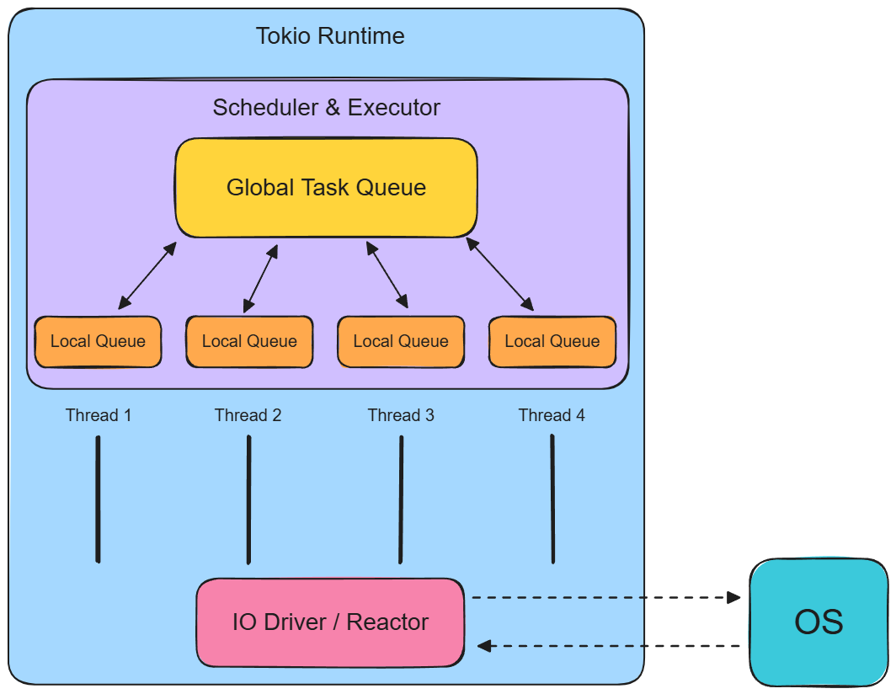
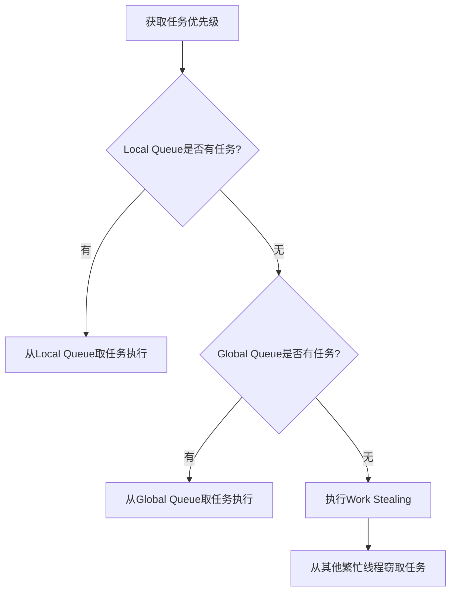
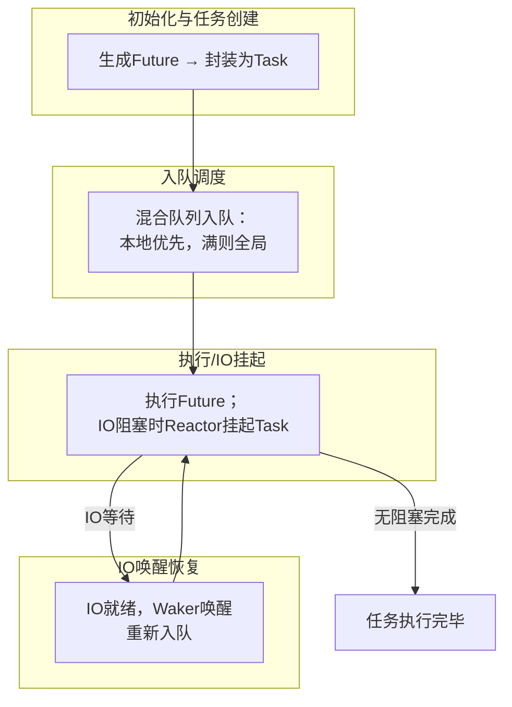

+++
title = 'Tokio Runtime 架构剖析：一个 Task 的诞生与旅程'
date = 2026-07-13T10:00:00+08:00
draft = false
description = '钻进 Tokio Runtime 内部，剖析 Task、混合队列、Work Stealing 与 Reactor 如何协作，驱动成千上万的异步任务'
categories = ['rust']
tags = ['rust', 'async', 'tokio']
+++

## 前言

最近在学习 Rust 时，发现其异步虽然和 JavaScript 的异步模型有相似之处，但 Rust 只提供了异步语法和 `Future` 抽象，而没有内置运行时，因此需要依赖异步运行时（runtime）来驱动 async 程序运行。

而 Rust 中最流行的异步运行时就是 Tokio。那么今天就来解析一下 Tokio Runtime 的架构，看看它是如何驱动成千上万个异步任务的。

## 背景 & 问题

Rust 中的 `async fn` 是惰性的——它编译成一个 Future 状态机，**没人 `poll` 它就永远不执行**。那么一个自然的问题来了：

> 当你写下 `#[tokio::main]` 并 `spawn` 成千上万个 task，这些 task 到底是谁在 `poll`？多核怎么分配？等 IO 时线程为什么没卡死？

要回答这个问题，就得了解 Tokio Runtime 内部，看清它的运作机制，而不是停留在"会用 `tokio::spawn`"的层面。

如果你想知道这些机制**从零怎么造出来**，可以看我写的《手写 Rust Async Model》系列；而这一篇反过来——**看生产级的 Tokio 是怎么把那些原理工程化的**。

### 能学到什么

- Tokio Runtime 的四大组件（Task / Scheduler / Queue / Reactor）各自的角色
- 混合队列、work-stealing、Park/Unpark 这几套机制如何协作
- 一条 task 从 `spawn` 到完成的完整旅程

### 一段再普通不过的代码

```rust
use std::time::Duration;

#[tokio::main]
async fn main() {
    let mut handles = vec![];
    for i in 1..=3 {
        handles.push(tokio::spawn(async move {
            // 每个 task 睡不同的时间后返回编号
            tokio::time::sleep(Duration::from_millis(500 * i as u64)).await;
            i
        }));
    }

    for h in handles {
        println!("done: {}", h.await.unwrap());
    }
}
```

3 个 task 并发 `sleep`，代码非常简单，底层却是 tokio runtime 的一套精密协作。下面我们用四个问题把它逐层拆开。

## 方案：用四个问题拆开 Runtime

先看一张全景图，建立整体印象，再逐个问题深入：



- **Worker 之间**互相 steal，没有中心调度器
- **Reactor** 在底部桥接 OS，事件就绪时唤醒对应 task

### Q1：async fn 编译成了 Future，谁来 poll 它？

先明确一个前提：`async fn` 编译成一个状态机 Future，**不主动 `poll` 就不会执行**。Tokio 的回答是 **Worker 线程 + Executor**。

- `multi_thread` runtime 启动时，会 spawn 一个 worker 线程池，默认数量 = CPU 核心数
- 每个 worker 线程跑一个调度循环：**取 task → poll → 处理结果 → 再取**
- 这个循环，就是 Executor 的本质

`#[tokio::main]` 宏会把 `async fn main` 展开成大致这样的同步 `main`，一次性搭起整套基础设施：

```rust
fn main() {
    // 构建一个多线程 runtime：启动 worker 线程池 + Reactor
    let runtime = tokio::runtime::Builder::new_multi_thread()
        .enable_all()
        .build()
        .unwrap();

    // 在 runtime 上阻塞地驱动 async main 这个 Future
    runtime.block_on(async_main());
}
```

这一步建立了 N 个 worker 线程、各自的 Local Queue、共享的 Global Queue、以及 Reactor，后续所有 task 都在这个环境里跑。

它本质上就是一个 `poll` 循环（如果你手写过最简 Executor，会立刻认出这个结构），只是从单线程升级成了线程池：

```
最简版：  一个线程 + 一个就绪队列 + 一个 poll 循环
Tokio：  N 个线程 + 每线程一个 Local Queue + work-stealing
```

### Q2：Tokio Runtime 中为什么能并发上万个 Task?

关键概念：**Task = 绿色线程**。

当一个 `Future` 被 runtime 接管，它会被封装成一个 Task，内部包含：

- Future 状态机本体
- Waker（唤醒机制）
- 调度所需的元数据

它不是 OS 线程，而是**用户态的轻量执行单元**，结构本身约 64 bytes 级别。这带来一个关键模型：

> **M:N 模型** —— M 个 task 复用 N 个 worker 线程（N 通常 = 核心数）

对比一下开销：

| 单位    | 栈 / 占用      | 1 万个的开销     |
| ------- | -------------- | ---------------- |
| OS 线程 | 默认 MB 级栈   | 约 10 GB，不可行 |
| Task    | 约 64 bytes 级 | 约 几百 KB，轻松 |

但有个常被误解的点要澄清：**task 的"并行"上限 = worker 线程数 N**。所谓"并发上万个"，是上万个 task 在 N 个线程上**分时复用**，而不是真的同时跑上万个。并发（concurrent）≠ 并行（parallel）。

### Q3：Tokio 是如何压榨 CPU 多核性能的？

这是 Tokio 性能设计的核心：**混合队列模型（Hybrid Queue）**。

| 队列         | 归属             | 特点                                                         |
| ------------ | ---------------- | ------------------------------------------------------------ |
| Local Queue  | 每个 worker 独享 | 所属 worker 无锁访问、cache 友好、ring buffer（约 256 slot） |
| Global Queue | 全 runtime 共享  | 需要加锁，用于跨 worker 分发与负载均衡                       |

**为什么这么设计？** 假设把所有 task 都丢进一个全局队列，那么每次取任务、放任务都要抢同一把锁，N 个线程会陷入经典的锁竞争瓶颈。

Tokio 的做法是让"快路径"绕开锁：

- task 优先进入**当前 worker 的 Local Queue**，取/放都无需互斥锁
- Local Queue 基于 ring buffer，队列头部常驻 CPU L1 Cache，取下一个 task 极快
- 只有需要跨 worker 分发的 task（比如 `spawn` 时不在 worker 上下文里，或 Local Queue 已满溢出）才进 Global Queue

于是 worker 取任务的优先级链是：



绝大多数情况下，worker 都在走第 1 步这条无锁快路径。

### Q4：某个 worker 空了，怎么办？

Tokio 用到了 **Work Stealing（工作窃取）** 来解决各 Worker 负载均衡的问题。这是一种**并行任务调度算法（Scheduling Algorithm）**，在其他语言也有类似实现。（比如 Java 的 ForkJoinPool；Go 的 GMP Scheduler 等）

它在 Tokio 里的运作机制：

- **触发时机**：当前 worker 的 Local Queue 和 Global Queue 都没有可执行任务
- **执行逻辑**：随机选一个其他 worker，从它的 Local Queue 窃取**大约一半**的任务，搬回自己的 Local Queue 继续执行
- **效果**：忙的 worker 被偷、闲的 worker 有活干，负载自动均衡

这套机制的好处是**没有中心调度器**——不像 master-slave 那样有个分发瓶颈，每个 worker 既干活又互相协调。

### Q5：task 在等 IO / sleep，worker 线程为什么没卡死？

这是 Reactor 登场的地方，也是事件驱动模型真正发挥价值的环节。

Reactor 是连接**异步任务**和**OS**的桥梁，负责监听和管理异步 I/O 事件。

当某个 task 的 Future 返回 `Pending`（比如 `sleep` 时间没到、socket 没数据），流程是这样的：

```
1. Future 把自己的 Waker 注册到 Reactor
2. worker 不阻塞，立刻去取下一个 task 继续跑
3. Reactor 基于 mio，底层是 OS 事件机制
     - Linux：epoll
     - macOS / BSD：kqueue
     - Windows：IOCP
4. OS 通知"事件就绪" → Reactor 找到对应的 Waker，并调用 wake() 方法唤醒 task
5. task 被重新标记为 Runnable，放回队列
6. 某个 worker 取到它，再次 poll
```

而 worker 在"实在没任务可做、也偷不到任务"时才会 **Park（挂起）**，被 `wake` 时 **Unpark** 恢复。这个 **Park / Unpark 循环** 让线程既不空转烧 CPU，也不会死锁阻塞。

## 实现步骤：一条 task 的完整旅程

把上面五个问题串联起来，一个 Tokio Task 的完整生命周期如下图：



下面按生命周期展开，对照开头那段并发 `sleep` 代码，看看 3 个 task 到底经历了什么。

### 创建与入队

循环里每调用一次 `tokio::spawn`：

```rust
tokio::spawn(async move {
    tokio::time::sleep(...).await;
    i
});
```

runtime 把这个 Future **封装成一个 Task**（约 64 bytes 的绿色线程），优先放入当前 worker 的 Local Queue（满了则溢出到 Global Queue）。从此它有了被调度的资格。

### 执行与挂起

某个 worker 从 Local Queue 取出 Task，开始 `poll`：

- 第一次 `poll` 时，`sleep` 时间没到
- Future 把自己的 `Waker` 注册到 runtime：**socket 等 IO 经 mio 挂到 epoll / kqueue / IOCP；`sleep` 这类定时器则注册到 runtime 内部的 timer**
- Future 返回 `Pending`
- **worker 不等待**，立刻去取下一个 task

这就是为什么 3 个 task 能"并发"——它们在 `sleep` 期间并不占用 worker，worker 一直在处理别的就绪 task。

### 唤醒与完成

事件就绪后，对应的 `Waker` 被触发：**IO 由 OS 经 epoll / kqueue / IOCP 通知 Reactor；定时器由 runtime 内部 timer 到期触发**。`Waker.wake()` 会把 task 标记为 Runnable、放回队列，必要时 `unpark` 一个休眠的 worker。

被唤醒的 task 再次被 worker 取出、`poll`。这次 `sleep` 已到期，Future 推进到 `Ready`，返回编号 `i`，Task 完成被回收。

最终 `h.await` 拿到返回值，打印 `done: 1 / 2 / 3`。整个过程中，worker 线程数始终是 N 个，却"同时"推进了 3 个甚至更多 task。

## 示例 & 踩坑

### 踩坑 1：在 async 里写阻塞调用，拖垮整个 worker

这是新手最容易踩、也最隐蔽的坑：

```rust
async fn bad_task() {
    // 错误：直接在 async 里阻塞
    // 这会卡死当前 worker 线程，导致该线程上的其它 task 全部跟着卡住
    std::thread::sleep(std::time::Duration::from_secs(1));
}
```

为什么严重？因为 worker 线程数有限（通常 = 核心数）。一个 task 把 worker 阻塞住，这个 worker 上的 Local Queue 里所有 task 都得排队等它。如果几个 task 同时这么干，整个 runtime 的吞吐会直接塌掉——**这正是 Q5 里 Reactor 要极力避免的场景**。

正确做法是用 `spawn_blocking`，把阻塞操作丢到**独立的阻塞线程池**：

```rust
async fn good_task() {
    // 正确：阻塞操作交给专门的阻塞线程池，不占用 worker
    tokio::task::spawn_blocking(|| {
        std::thread::sleep(std::time::Duration::from_secs(1));
    })
    .await
    .unwrap();
}
```

`spawn_blocking` 的线程池和 worker 线程池是分开的，专门用来吸收阻塞调用，不参与 work-stealing 的快路径。

### 踩坑 2：选错 runtime flavor

`#[tokio::main]` 默认是 `multi_thread`（worker 池 + work-stealing）。也可以显式选单线程：

```rust
// 单线程 runtime：只有一个 worker，没有 work-stealing
#[tokio::main(flavor = "current_thread")]
async fn main() { /* ... */ }
```

选型建议：

| 场景                                 | 选择             | 原因                             |
| ------------------------------------ | ---------------- | -------------------------------- |
| CPU 密集 + 高并发 IO（大多数服务端） | `multi_thread`   | 用满多核，work-stealing 自动均衡 |
| 简单 CLI、嵌入式、单核环境           | `current_thread` | 无线程切换开销，体积更小         |
| 纯 IO 绑定、低并发                   | `current_thread` | 够用，省资源                     |

记住：`current_thread` 下没有 Q4 的 work-stealing，所有 task 都在一个线程上分时复用。

### 边界情况：Local Queue 会满

Local Queue 容量有限（约 256 个 slot）。当某个 worker 在极短时间内 `spawn` 大量 task，超出容量时，**溢出的 task 会被推入 Global Queue**，等待其他 worker 通过优先级链的第 2 步取走。这是混合队列模型自带的"泄压阀"，不会因为本地队列满而丢任务。

## 总结

### 📦Tokio Runtime 核心组件

| 组件               | 核心说明                                                                |
| ------------------ | ----------------------------------------------------------------------- |
| Task               | 轻量级任务单元，仅占用 64 Bytes，是最小可调度工作载体                   |
| Queue              | 采用本地队列 + 全局队列 + 任务窃取的混合调度队列模型                    |
| Scheduler/Executor | 负责任务分发、调度与实际执行，管理线程任务流转                          |
| Reactor            | 基于 Mio 实现的 IO 事件驱动层，维护线程阻塞（Park）与唤醒（Unpark）循环 |

### 一些相关概念

1. **Task = 绿色线程**：约 64 bytes 的用户态执行单元，M:N 模型让上万个 task 复用 N 个 worker 线程
2. **混合队列**：Local Queue（无锁快路径）+ Global Queue（跨 worker 分发），让多核协作不退化为锁竞争
3. **Work Stealing**：worker 空了就随机偷别人"一半"的任务，无中心调度器也能负载均衡
4. **Reactor + Park/Unpark**：task 等 IO 时不占线程，OS 事件就绪再唤醒，线程空了才挂起

### 原理 → 工业实现

Tokio 的每一处工程化设计，本质上都是对 Rust 的异步运行时基础框架在生产环境下的回答：

| 基础原理            | Tokio 的工业实现                           |
| ------------------- | ------------------------------------------ |
| Future（状态机）    | Task（绿色线程，封装 Future + Waker）      |
| 单线程 poll 循环    | Worker 线程池 + 混合队列                   |
| 就绪队列            | Local Queue（无锁）+ Global Queue          |
| 负载均衡            | Work Stealing                              |
| Reactor（事件监听） | 基于 mio 的 epoll / kqueue / IOCP 事件循环 |

想从零理解这些原理的来龙去脉，推荐看我的《手写 Rust Async Model》系列——这一篇正是那套原理在生产运行时里的落点。

### References

- [How Rust engineered the perfect async runtime - Youtube](https://www.youtube.com/watch?v=FUg1y-yv6cs&list=WL&index=10&t=13s)
- [Tokio 官方教程](https://tokio.rs/tokio/tutorial) —— 从使用角度系统学习 Tokio
- [Tokio 源码](https://github.com/tokio-rs/tokio) —— `tokio/src/runtime/` 下能看到 worker、queue、scheduler 的真实实现
- 《手写 Rust Async Model》系列 —— 本文所有概念"从零造出来"的版本
